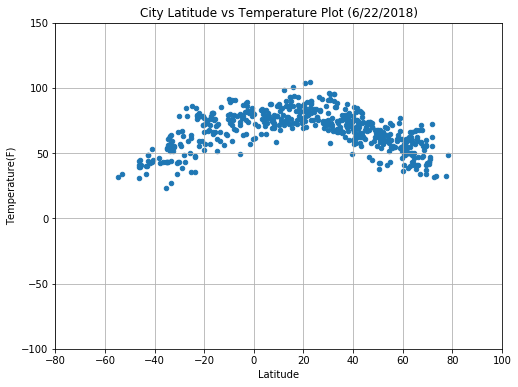
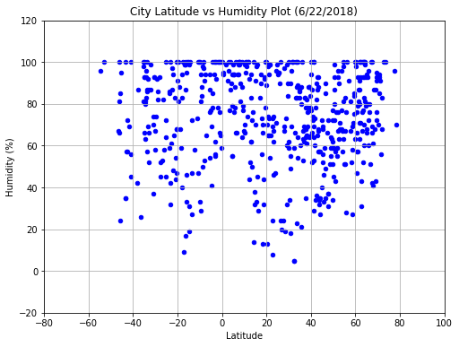
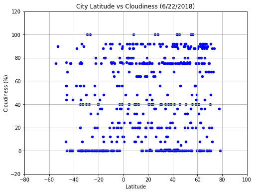
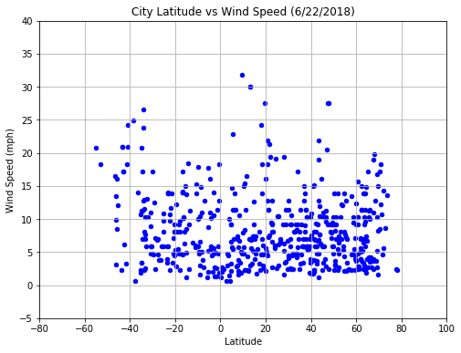

# WeatherPy

### Analysis

##### 1. Temperatures drop the further an area is from the equator. There is a limitation of this data set: observation only one time point during the year, and coastal locations tend to be cooler in summer and warmer in winter than places inland at the same latitude and altitude. It will be a better idea to draw the plot on a google map instead simply by latitude. 

##### 2. Humidity doesn't have much correlation to latitude. Across all latitudes in selected samples, the most populated humidity % falls between 50-100%. When it getting closer to 20 degrees North or 20 degrees South, the humidity could have larger variance, could be as extreme as 5% to 100%. 

##### 3. The cloudiness are measured at every 5% level, meaning it could not shows consistent range like humidity or temperature. And the biggest popularities stay in 0%, 75%, and 90%. It might because at certain latitude, oceans are more than continent, which tend to be less cloudy than oceans.  

##### 4. There are some correlation found between latitude and wind speed, but not very significant. Very fast wind speed are observed at very high latitude (50-80). The most common wind speed are under 10mph, very few cities has wind speed higher than 25, and those are all from High Latitude both Northern Hemisphere, and South Hemisphere.


```python
!pip install citipy
```

    Requirement already satisfied: citipy in c:\users\shangw\appdata\local\continuum\anaconda3\lib\site-packages
    Requirement already satisfied: kdtree>=0.12 in c:\users\shangw\appdata\local\continuum\anaconda3\lib\site-packages (from citipy)
    

    You are using pip version 9.0.1, however version 10.0.1 is available.
    You should consider upgrading via the 'python -m pip install --upgrade pip' command.
    


```python
 # Dependencies
import csv
import matplotlib.pyplot as plt
import requests as req
import pandas as pd
import json
from citipy import citipy

import numpy as np
import random
import pprint

#import api_key
from config import api_key
```

### Generate Cities List


```python
# Create a coordinate to store random latitude and longitude
coordinates =[]
# Randomly pick 1500 through all lat/lon
for x in range(1500):
    latitude = random.randint(-90,90)
    longitude = random.randint(-180,180)
    coordinates.append((latitude,longitude))

# looking for nearest_city by lat,lon
cities = []
for coordinate_pair in coordinates:
    lat, lon = coordinate_pair
    cities.append(citipy.nearest_city(lat, lon))    

# create new list for city name    
city_names =[]
for city in cities:
    city_names.append(city.city_name)
    # remove duplication in city name
    unique_city_names = list(set(city_names))
    
```

### Perform API Calls


```python
# Create empty list for data append

city_name_api = []
Humidity_data = []
Cloudiness_data = []
Temperature_data = []
Country_data = []
Lat_data = []
Lon_data = []
Wind_speed_data = []


# Create an empty list to store JSON response objects

count = 0
for names in unique_city_names:
    try:
    
        # Set up url
        url = "http://api.openweathermap.org/data/2.5/weather?"
        units = "Imperial"
        count += 1
        
        # Build partial query URL
        query_url = f"{url}appid={api_key}&units={units}&q={names}"
        weather_data = req.get(query_url).json()
        

        print("Processing Record of Number " + str(count) + ' Data Sample | ' + names + " " + query_url)

        # Extract the city name, temperature, Cloudiness, and weather description of each City

        city_name_api.append(weather_data['name'])
        Humidity_data.append(weather_data['main']['humidity'])
        Cloudiness_data.append(weather_data['clouds']['all'])
        Temperature_data.append(weather_data['main']['temp'])
        Country_data.append(weather_data['sys']['country'])
        Lat_data.append(weather_data['coord']['lat'])
        Lon_data.append(weather_data['coord']['lon'])
        Wind_speed_data.append(weather_data['wind']['speed'])
    
    except:
        pass
                            
# Once complete API Calls print below
print("-------------Data Retrieval Complete------------")

```

    Processing Record of Number 1 Data Sample | morro bay http://api.openweathermap.org/data/2.5/weather?appid=5bf52d3f5d1b818f0adbcbb19de784bc&units=Imperial&q=morro bay
    Processing Record of Number 2 Data Sample | doka http://api.openweathermap.org/data/2.5/weather?appid=5bf52d3f5d1b818f0adbcbb19de784bc&units=Imperial&q=doka
    Processing Record of Number 3 Data Sample | marzuq http://api.openweathermap.org/data/2.5/weather?appid=5bf52d3f5d1b818f0adbcbb19de784bc&units=Imperial&q=marzuq
    Processing Record of Number 4 Data Sample | salym http://api.openweathermap.org/data/2.5/weather?appid=5bf52d3f5d1b818f0adbcbb19de784bc&units=Imperial&q=salym
    Processing Record of Number 5 Data Sample | high level http://api.openweathermap.org/data/2.5/weather?appid=5bf52d3f5d1b818f0adbcbb19de784bc&units=Imperial&q=high level
    Processing Record of Number 6 Data Sample | khatanga http://api.openweathermap.org/data/2.5/weather?appid=5bf52d3f5d1b818f0adbcbb19de784bc&units=Imperial&q=khatanga
    Processing Record of Number 7 Data Sample | naze http://api.openweathermap.org/data/2.5/weather?appid=5bf52d3f5d1b818f0adbcbb19de784bc&units=Imperial&q=naze
    Processing Record of Number 8 Data Sample | plettenberg bay http://api.openweathermap.org/data/2.5/weather?appid=5bf52d3f5d1b818f0adbcbb19de784bc&units=Imperial&q=plettenberg bay
    Processing Record of Number 9 Data Sample | trelew http://api.openweathermap.org/data/2.5/weather?appid=5bf52d3f5d1b818f0adbcbb19de784bc&units=Imperial&q=trelew
    Processing Record of Number 10 Data Sample | rio grande http://api.openweathermap.org/data/2.5/weather?appid=5bf52d3f5d1b818f0adbcbb19de784bc&units=Imperial&q=rio grande
    Processing Record of Number 11 Data Sample | meylan http://api.openweathermap.org/data/2.5/weather?appid=5bf52d3f5d1b818f0adbcbb19de784bc&units=Imperial&q=meylan
    Processing Record of Number 12 Data Sample | guerrero negro http://api.openweathermap.org/data/2.5/weather?appid=5bf52d3f5d1b818f0adbcbb19de784bc&units=Imperial&q=guerrero negro
    Processing Record of Number 13 Data Sample | norman wells http://api.openweathermap.org/data/2.5/weather?appid=5bf52d3f5d1b818f0adbcbb19de784bc&units=Imperial&q=norman wells
    Processing Record of Number 14 Data Sample | camrose http://api.openweathermap.org/data/2.5/weather?appid=5bf52d3f5d1b818f0adbcbb19de784bc&units=Imperial&q=camrose
    Processing Record of Number 15 Data Sample | hit http://api.openweathermap.org/data/2.5/weather?appid=5bf52d3f5d1b818f0adbcbb19de784bc&units=Imperial&q=hit
    Processing Record of Number 16 Data Sample | gunupur http://api.openweathermap.org/data/2.5/weather?appid=5bf52d3f5d1b818f0adbcbb19de784bc&units=Imperial&q=gunupur
    Processing Record of Number 17 Data Sample | arica http://api.openweathermap.org/data/2.5/weather?appid=5bf52d3f5d1b818f0adbcbb19de784bc&units=Imperial&q=arica
    Processing Record of Number 18 Data Sample | gravdal http://api.openweathermap.org/data/2.5/weather?appid=5bf52d3f5d1b818f0adbcbb19de784bc&units=Imperial&q=gravdal
    Processing Record of Number 19 Data Sample | ust-nera http://api.openweathermap.org/data/2.5/weather?appid=5bf52d3f5d1b818f0adbcbb19de784bc&units=Imperial&q=ust-nera
    Processing Record of Number 20 Data Sample | sakakah http://api.openweathermap.org/data/2.5/weather?appid=5bf52d3f5d1b818f0adbcbb19de784bc&units=Imperial&q=sakakah
    Processing Record of Number 21 Data Sample | buala http://api.openweathermap.org/data/2.5/weather?appid=5bf52d3f5d1b818f0adbcbb19de784bc&units=Imperial&q=buala
    Processing Record of Number 22 Data Sample | innisfail http://api.openweathermap.org/data/2.5/weather?appid=5bf52d3f5d1b818f0adbcbb19de784bc&units=Imperial&q=innisfail
    Processing Record of Number 23 Data Sample | atuona http://api.openweathermap.org/data/2.5/weather?appid=5bf52d3f5d1b818f0adbcbb19de784bc&units=Imperial&q=atuona
    Processing Record of Number 24 Data Sample | chapais http://api.openweathermap.org/data/2.5/weather?appid=5bf52d3f5d1b818f0adbcbb19de784bc&units=Imperial&q=chapais
    Processing Record of Number 25 Data Sample | la peca http://api.openweathermap.org/data/2.5/weather?appid=5bf52d3f5d1b818f0adbcbb19de784bc&units=Imperial&q=la peca
    Processing Record of Number 26 Data Sample | salalah http://api.openweathermap.org/data/2.5/weather?appid=5bf52d3f5d1b818f0adbcbb19de784bc&units=Imperial&q=salalah
    Processing Record of Number 27 Data Sample | arraial do cabo http://api.openweathermap.org/data/2.5/weather?appid=5bf52d3f5d1b818f0adbcbb19de784bc&units=Imperial&q=arraial do cabo
    Processing Record of Number 28 Data Sample | morant bay http://api.openweathermap.org/data/2.5/weather?appid=5bf52d3f5d1b818f0adbcbb19de784bc&units=Imperial&q=morant bay
    Processing Record of Number 29 Data Sample | pemangkat http://api.openweathermap.org/data/2.5/weather?appid=5bf52d3f5d1b818f0adbcbb19de784bc&units=Imperial&q=pemangkat
    Processing Record of Number 30 Data Sample | jamestown http://api.openweathermap.org/data/2.5/weather?appid=5bf52d3f5d1b818f0adbcbb19de784bc&units=Imperial&q=jamestown
    Processing Record of Number 31 Data Sample | toamasina http://api.openweathermap.org/data/2.5/weather?appid=5bf52d3f5d1b818f0adbcbb19de784bc&units=Imperial&q=toamasina
    Processing Record of Number 32 Data Sample | henties bay http://api.openweathermap.org/data/2.5/weather?appid=5bf52d3f5d1b818f0adbcbb19de784bc&units=Imperial&q=henties bay
    Processing Record of Number 33 Data Sample | sao domingos http://api.openweathermap.org/data/2.5/weather?appid=5bf52d3f5d1b818f0adbcbb19de784bc&units=Imperial&q=sao domingos
    Processing Record of Number 34 Data Sample | nambucca heads http://api.openweathermap.org/data/2.5/weather?appid=5bf52d3f5d1b818f0adbcbb19de784bc&units=Imperial&q=nambucca heads
    Processing Record of Number 35 Data Sample | kununurra http://api.openweathermap.org/data/2.5/weather?appid=5bf52d3f5d1b818f0adbcbb19de784bc&units=Imperial&q=kununurra
    Processing Record of Number 36 Data Sample | kungurtug http://api.openweathermap.org/data/2.5/weather?appid=5bf52d3f5d1b818f0adbcbb19de784bc&units=Imperial&q=kungurtug
    Processing Record of Number 37 Data Sample | mar del plata http://api.openweathermap.org/data/2.5/weather?appid=5bf52d3f5d1b818f0adbcbb19de784bc&units=Imperial&q=mar del plata
    Processing Record of Number 38 Data Sample | turukhansk http://api.openweathermap.org/data/2.5/weather?appid=5bf52d3f5d1b818f0adbcbb19de784bc&units=Imperial&q=turukhansk
    Processing Record of Number 39 Data Sample | bredasdorp http://api.openweathermap.org/data/2.5/weather?appid=5bf52d3f5d1b818f0adbcbb19de784bc&units=Imperial&q=bredasdorp
    Processing Record of Number 40 Data Sample | vestmanna http://api.openweathermap.org/data/2.5/weather?appid=5bf52d3f5d1b818f0adbcbb19de784bc&units=Imperial&q=vestmanna
    Processing Record of Number 41 Data Sample | puerto lopez http://api.openweathermap.org/data/2.5/weather?appid=5bf52d3f5d1b818f0adbcbb19de784bc&units=Imperial&q=puerto lopez
    Processing Record of Number 42 Data Sample | dikson http://api.openweathermap.org/data/2.5/weather?appid=5bf52d3f5d1b818f0adbcbb19de784bc&units=Imperial&q=dikson
    Processing Record of Number 43 Data Sample | sisimiut http://api.openweathermap.org/data/2.5/weather?appid=5bf52d3f5d1b818f0adbcbb19de784bc&units=Imperial&q=sisimiut
    Processing Record of Number 44 Data Sample | provideniya http://api.openweathermap.org/data/2.5/weather?appid=5bf52d3f5d1b818f0adbcbb19de784bc&units=Imperial&q=provideniya
    Processing Record of Number 45 Data Sample | mmabatho http://api.openweathermap.org/data/2.5/weather?appid=5bf52d3f5d1b818f0adbcbb19de784bc&units=Imperial&q=mmabatho
    Processing Record of Number 46 Data Sample | ontario http://api.openweathermap.org/data/2.5/weather?appid=5bf52d3f5d1b818f0adbcbb19de784bc&units=Imperial&q=ontario
    Processing Record of Number 47 Data Sample | richards bay http://api.openweathermap.org/data/2.5/weather?appid=5bf52d3f5d1b818f0adbcbb19de784bc&units=Imperial&q=richards bay
    Processing Record of Number 48 Data Sample | coquimbo http://api.openweathermap.org/data/2.5/weather?appid=5bf52d3f5d1b818f0adbcbb19de784bc&units=Imperial&q=coquimbo
    Processing Record of Number 49 Data Sample | semnan http://api.openweathermap.org/data/2.5/weather?appid=5bf52d3f5d1b818f0adbcbb19de784bc&units=Imperial&q=semnan
    Processing Record of Number 50 Data Sample | victoria http://api.openweathermap.org/data/2.5/weather?appid=5bf52d3f5d1b818f0adbcbb19de784bc&units=Imperial&q=victoria
    Processing Record of Number 51 Data Sample | derventa http://api.openweathermap.org/data/2.5/weather?appid=5bf52d3f5d1b818f0adbcbb19de784bc&units=Imperial&q=derventa
    Processing Record of Number 52 Data Sample | katiola http://api.openweathermap.org/data/2.5/weather?appid=5bf52d3f5d1b818f0adbcbb19de784bc&units=Imperial&q=katiola
    Processing Record of Number 53 Data Sample | altay http://api.openweathermap.org/data/2.5/weather?appid=5bf52d3f5d1b818f0adbcbb19de784bc&units=Imperial&q=altay
    Processing Record of Number 54 Data Sample | camana http://api.openweathermap.org/data/2.5/weather?appid=5bf52d3f5d1b818f0adbcbb19de784bc&units=Imperial&q=camana
    Processing Record of Number 55 Data Sample | narsaq http://api.openweathermap.org/data/2.5/weather?appid=5bf52d3f5d1b818f0adbcbb19de784bc&units=Imperial&q=narsaq
    Processing Record of Number 56 Data Sample | ponta do sol http://api.openweathermap.org/data/2.5/weather?appid=5bf52d3f5d1b818f0adbcbb19de784bc&units=Imperial&q=ponta do sol
    Processing Record of Number 57 Data Sample | the valley http://api.openweathermap.org/data/2.5/weather?appid=5bf52d3f5d1b818f0adbcbb19de784bc&units=Imperial&q=the valley
    Processing Record of Number 58 Data Sample | takoradi http://api.openweathermap.org/data/2.5/weather?appid=5bf52d3f5d1b818f0adbcbb19de784bc&units=Imperial&q=takoradi
    Processing Record of Number 59 Data Sample | marystown http://api.openweathermap.org/data/2.5/weather?appid=5bf52d3f5d1b818f0adbcbb19de784bc&units=Imperial&q=marystown
    Processing Record of Number 60 Data Sample | hlotse http://api.openweathermap.org/data/2.5/weather?appid=5bf52d3f5d1b818f0adbcbb19de784bc&units=Imperial&q=hlotse
    Processing Record of Number 61 Data Sample | kalianget http://api.openweathermap.org/data/2.5/weather?appid=5bf52d3f5d1b818f0adbcbb19de784bc&units=Imperial&q=kalianget
    Processing Record of Number 62 Data Sample | shaoguan http://api.openweathermap.org/data/2.5/weather?appid=5bf52d3f5d1b818f0adbcbb19de784bc&units=Imperial&q=shaoguan
    Processing Record of Number 63 Data Sample | camopi http://api.openweathermap.org/data/2.5/weather?appid=5bf52d3f5d1b818f0adbcbb19de784bc&units=Imperial&q=camopi
    Processing Record of Number 64 Data Sample | coahuayana http://api.openweathermap.org/data/2.5/weather?appid=5bf52d3f5d1b818f0adbcbb19de784bc&units=Imperial&q=coahuayana
    Processing Record of Number 65 Data Sample | los llanos de aridane http://api.openweathermap.org/data/2.5/weather?appid=5bf52d3f5d1b818f0adbcbb19de784bc&units=Imperial&q=los llanos de aridane
    Processing Record of Number 66 Data Sample | nouadhibou http://api.openweathermap.org/data/2.5/weather?appid=5bf52d3f5d1b818f0adbcbb19de784bc&units=Imperial&q=nouadhibou
    Processing Record of Number 67 Data Sample | shingu http://api.openweathermap.org/data/2.5/weather?appid=5bf52d3f5d1b818f0adbcbb19de784bc&units=Imperial&q=shingu
    Processing Record of Number 68 Data Sample | rabaul http://api.openweathermap.org/data/2.5/weather?appid=5bf52d3f5d1b818f0adbcbb19de784bc&units=Imperial&q=rabaul
    Processing Record of Number 69 Data Sample | ushuaia http://api.openweathermap.org/data/2.5/weather?appid=5bf52d3f5d1b818f0adbcbb19de784bc&units=Imperial&q=ushuaia
    Processing Record of Number 70 Data Sample | ilulissat http://api.openweathermap.org/data/2.5/weather?appid=5bf52d3f5d1b818f0adbcbb19de784bc&units=Imperial&q=ilulissat
    Processing Record of Number 71 Data Sample | koulikoro http://api.openweathermap.org/data/2.5/weather?appid=5bf52d3f5d1b818f0adbcbb19de784bc&units=Imperial&q=koulikoro
    Processing Record of Number 72 Data Sample | nizhnevartovsk http://api.openweathermap.org/data/2.5/weather?appid=5bf52d3f5d1b818f0adbcbb19de784bc&units=Imperial&q=nizhnevartovsk
    Processing Record of Number 73 Data Sample | kodiak http://api.openweathermap.org/data/2.5/weather?appid=5bf52d3f5d1b818f0adbcbb19de784bc&units=Imperial&q=kodiak
    Processing Record of Number 74 Data Sample | manoel urbano http://api.openweathermap.org/data/2.5/weather?appid=5bf52d3f5d1b818f0adbcbb19de784bc&units=Imperial&q=manoel urbano
    Processing Record of Number 75 Data Sample | bolshoy uluy http://api.openweathermap.org/data/2.5/weather?appid=5bf52d3f5d1b818f0adbcbb19de784bc&units=Imperial&q=bolshoy uluy
    Processing Record of Number 76 Data Sample | belmonte http://api.openweathermap.org/data/2.5/weather?appid=5bf52d3f5d1b818f0adbcbb19de784bc&units=Imperial&q=belmonte
    Processing Record of Number 77 Data Sample | siderno http://api.openweathermap.org/data/2.5/weather?appid=5bf52d3f5d1b818f0adbcbb19de784bc&units=Imperial&q=siderno
    Processing Record of Number 78 Data Sample | gorno-chuyskiy http://api.openweathermap.org/data/2.5/weather?appid=5bf52d3f5d1b818f0adbcbb19de784bc&units=Imperial&q=gorno-chuyskiy
    Processing Record of Number 79 Data Sample | orsha http://api.openweathermap.org/data/2.5/weather?appid=5bf52d3f5d1b818f0adbcbb19de784bc&units=Imperial&q=orsha
    Processing Record of Number 80 Data Sample | kapaa http://api.openweathermap.org/data/2.5/weather?appid=5bf52d3f5d1b818f0adbcbb19de784bc&units=Imperial&q=kapaa
    Processing Record of Number 81 Data Sample | kongolo http://api.openweathermap.org/data/2.5/weather?appid=5bf52d3f5d1b818f0adbcbb19de784bc&units=Imperial&q=kongolo
    Processing Record of Number 82 Data Sample | dien bien http://api.openweathermap.org/data/2.5/weather?appid=5bf52d3f5d1b818f0adbcbb19de784bc&units=Imperial&q=dien bien
    Processing Record of Number 83 Data Sample | kobayashi http://api.openweathermap.org/data/2.5/weather?appid=5bf52d3f5d1b818f0adbcbb19de784bc&units=Imperial&q=kobayashi
    Processing Record of Number 84 Data Sample | hamilton http://api.openweathermap.org/data/2.5/weather?appid=5bf52d3f5d1b818f0adbcbb19de784bc&units=Imperial&q=hamilton
    Processing Record of Number 85 Data Sample | zolotinka http://api.openweathermap.org/data/2.5/weather?appid=5bf52d3f5d1b818f0adbcbb19de784bc&units=Imperial&q=zolotinka
    Processing Record of Number 86 Data Sample | dingle http://api.openweathermap.org/data/2.5/weather?appid=5bf52d3f5d1b818f0adbcbb19de784bc&units=Imperial&q=dingle
    Processing Record of Number 87 Data Sample | moerai http://api.openweathermap.org/data/2.5/weather?appid=5bf52d3f5d1b818f0adbcbb19de784bc&units=Imperial&q=moerai
    Processing Record of Number 88 Data Sample | hofn http://api.openweathermap.org/data/2.5/weather?appid=5bf52d3f5d1b818f0adbcbb19de784bc&units=Imperial&q=hofn
    Processing Record of Number 89 Data Sample | barrow http://api.openweathermap.org/data/2.5/weather?appid=5bf52d3f5d1b818f0adbcbb19de784bc&units=Imperial&q=barrow
    Processing Record of Number 90 Data Sample | constitucion http://api.openweathermap.org/data/2.5/weather?appid=5bf52d3f5d1b818f0adbcbb19de784bc&units=Imperial&q=constitucion
    Processing Record of Number 91 Data Sample | bubaque http://api.openweathermap.org/data/2.5/weather?appid=5bf52d3f5d1b818f0adbcbb19de784bc&units=Imperial&q=bubaque
    Processing Record of Number 92 Data Sample | port lincoln http://api.openweathermap.org/data/2.5/weather?appid=5bf52d3f5d1b818f0adbcbb19de784bc&units=Imperial&q=port lincoln
    Processing Record of Number 93 Data Sample | la orilla http://api.openweathermap.org/data/2.5/weather?appid=5bf52d3f5d1b818f0adbcbb19de784bc&units=Imperial&q=la orilla
    Processing Record of Number 94 Data Sample | bereznik http://api.openweathermap.org/data/2.5/weather?appid=5bf52d3f5d1b818f0adbcbb19de784bc&units=Imperial&q=bereznik
    Processing Record of Number 95 Data Sample | pangnirtung http://api.openweathermap.org/data/2.5/weather?appid=5bf52d3f5d1b818f0adbcbb19de784bc&units=Imperial&q=pangnirtung
    Processing Record of Number 96 Data Sample | fuling http://api.openweathermap.org/data/2.5/weather?appid=5bf52d3f5d1b818f0adbcbb19de784bc&units=Imperial&q=fuling
    Processing Record of Number 97 Data Sample | koindu http://api.openweathermap.org/data/2.5/weather?appid=5bf52d3f5d1b818f0adbcbb19de784bc&units=Imperial&q=koindu
    Processing Record of Number 98 Data Sample | talnakh http://api.openweathermap.org/data/2.5/weather?appid=5bf52d3f5d1b818f0adbcbb19de784bc&units=Imperial&q=talnakh
    Processing Record of Number 99 Data Sample | altagracia de orituco http://api.openweathermap.org/data/2.5/weather?appid=5bf52d3f5d1b818f0adbcbb19de784bc&units=Imperial&q=altagracia de orituco
    Processing Record of Number 100 Data Sample | lapua http://api.openweathermap.org/data/2.5/weather?appid=5bf52d3f5d1b818f0adbcbb19de784bc&units=Imperial&q=lapua
    Processing Record of Number 101 Data Sample | severo-kurilsk http://api.openweathermap.org/data/2.5/weather?appid=5bf52d3f5d1b818f0adbcbb19de784bc&units=Imperial&q=severo-kurilsk
    Processing Record of Number 102 Data Sample | kaitangata http://api.openweathermap.org/data/2.5/weather?appid=5bf52d3f5d1b818f0adbcbb19de784bc&units=Imperial&q=kaitangata
    Processing Record of Number 103 Data Sample | port blair http://api.openweathermap.org/data/2.5/weather?appid=5bf52d3f5d1b818f0adbcbb19de784bc&units=Imperial&q=port blair
    Processing Record of Number 104 Data Sample | charters towers http://api.openweathermap.org/data/2.5/weather?appid=5bf52d3f5d1b818f0adbcbb19de784bc&units=Imperial&q=charters towers
    Processing Record of Number 105 Data Sample | galyugayevskaya http://api.openweathermap.org/data/2.5/weather?appid=5bf52d3f5d1b818f0adbcbb19de784bc&units=Imperial&q=galyugayevskaya
    Processing Record of Number 106 Data Sample | laguna http://api.openweathermap.org/data/2.5/weather?appid=5bf52d3f5d1b818f0adbcbb19de784bc&units=Imperial&q=laguna
    Processing Record of Number 107 Data Sample | bartlesville http://api.openweathermap.org/data/2.5/weather?appid=5bf52d3f5d1b818f0adbcbb19de784bc&units=Imperial&q=bartlesville
    Processing Record of Number 108 Data Sample | cape town http://api.openweathermap.org/data/2.5/weather?appid=5bf52d3f5d1b818f0adbcbb19de784bc&units=Imperial&q=cape town
    Processing Record of Number 109 Data Sample | namibe http://api.openweathermap.org/data/2.5/weather?appid=5bf52d3f5d1b818f0adbcbb19de784bc&units=Imperial&q=namibe
    Processing Record of Number 110 Data Sample | nicoya http://api.openweathermap.org/data/2.5/weather?appid=5bf52d3f5d1b818f0adbcbb19de784bc&units=Imperial&q=nicoya
    Processing Record of Number 111 Data Sample | bengkulu http://api.openweathermap.org/data/2.5/weather?appid=5bf52d3f5d1b818f0adbcbb19de784bc&units=Imperial&q=bengkulu
    Processing Record of Number 112 Data Sample | terrace bay http://api.openweathermap.org/data/2.5/weather?appid=5bf52d3f5d1b818f0adbcbb19de784bc&units=Imperial&q=terrace bay
    Processing Record of Number 113 Data Sample | antalaha http://api.openweathermap.org/data/2.5/weather?appid=5bf52d3f5d1b818f0adbcbb19de784bc&units=Imperial&q=antalaha
    Processing Record of Number 114 Data Sample | komsomolskiy http://api.openweathermap.org/data/2.5/weather?appid=5bf52d3f5d1b818f0adbcbb19de784bc&units=Imperial&q=komsomolskiy
    Processing Record of Number 115 Data Sample | stornoway http://api.openweathermap.org/data/2.5/weather?appid=5bf52d3f5d1b818f0adbcbb19de784bc&units=Imperial&q=stornoway
    Processing Record of Number 116 Data Sample | thomaston http://api.openweathermap.org/data/2.5/weather?appid=5bf52d3f5d1b818f0adbcbb19de784bc&units=Imperial&q=thomaston
    Processing Record of Number 117 Data Sample | okha http://api.openweathermap.org/data/2.5/weather?appid=5bf52d3f5d1b818f0adbcbb19de784bc&units=Imperial&q=okha
    Processing Record of Number 118 Data Sample | caravelas http://api.openweathermap.org/data/2.5/weather?appid=5bf52d3f5d1b818f0adbcbb19de784bc&units=Imperial&q=caravelas
    Processing Record of Number 119 Data Sample | coffs harbour http://api.openweathermap.org/data/2.5/weather?appid=5bf52d3f5d1b818f0adbcbb19de784bc&units=Imperial&q=coffs harbour
    Processing Record of Number 120 Data Sample | havre-saint-pierre http://api.openweathermap.org/data/2.5/weather?appid=5bf52d3f5d1b818f0adbcbb19de784bc&units=Imperial&q=havre-saint-pierre
    Processing Record of Number 121 Data Sample | saint george http://api.openweathermap.org/data/2.5/weather?appid=5bf52d3f5d1b818f0adbcbb19de784bc&units=Imperial&q=saint george
    Processing Record of Number 122 Data Sample | evensk http://api.openweathermap.org/data/2.5/weather?appid=5bf52d3f5d1b818f0adbcbb19de784bc&units=Imperial&q=evensk
    Processing Record of Number 123 Data Sample | tuatapere http://api.openweathermap.org/data/2.5/weather?appid=5bf52d3f5d1b818f0adbcbb19de784bc&units=Imperial&q=tuatapere
    Processing Record of Number 124 Data Sample | pietarsaari http://api.openweathermap.org/data/2.5/weather?appid=5bf52d3f5d1b818f0adbcbb19de784bc&units=Imperial&q=pietarsaari
    Processing Record of Number 125 Data Sample | clyde river http://api.openweathermap.org/data/2.5/weather?appid=5bf52d3f5d1b818f0adbcbb19de784bc&units=Imperial&q=clyde river
    Processing Record of Number 126 Data Sample | atar http://api.openweathermap.org/data/2.5/weather?appid=5bf52d3f5d1b818f0adbcbb19de784bc&units=Imperial&q=atar
    Processing Record of Number 127 Data Sample | vila franca do campo http://api.openweathermap.org/data/2.5/weather?appid=5bf52d3f5d1b818f0adbcbb19de784bc&units=Imperial&q=vila franca do campo
    Processing Record of Number 128 Data Sample | marawi http://api.openweathermap.org/data/2.5/weather?appid=5bf52d3f5d1b818f0adbcbb19de784bc&units=Imperial&q=marawi
    Processing Record of Number 129 Data Sample | jabiru http://api.openweathermap.org/data/2.5/weather?appid=5bf52d3f5d1b818f0adbcbb19de784bc&units=Imperial&q=jabiru
    Processing Record of Number 130 Data Sample | waingapu http://api.openweathermap.org/data/2.5/weather?appid=5bf52d3f5d1b818f0adbcbb19de784bc&units=Imperial&q=waingapu
    Processing Record of Number 131 Data Sample | zonguldak http://api.openweathermap.org/data/2.5/weather?appid=5bf52d3f5d1b818f0adbcbb19de784bc&units=Imperial&q=zonguldak
    Processing Record of Number 132 Data Sample | castro http://api.openweathermap.org/data/2.5/weather?appid=5bf52d3f5d1b818f0adbcbb19de784bc&units=Imperial&q=castro
    Processing Record of Number 133 Data Sample | harer http://api.openweathermap.org/data/2.5/weather?appid=5bf52d3f5d1b818f0adbcbb19de784bc&units=Imperial&q=harer
    Processing Record of Number 134 Data Sample | veraval http://api.openweathermap.org/data/2.5/weather?appid=5bf52d3f5d1b818f0adbcbb19de784bc&units=Imperial&q=veraval
    Processing Record of Number 135 Data Sample | kruisfontein http://api.openweathermap.org/data/2.5/weather?appid=5bf52d3f5d1b818f0adbcbb19de784bc&units=Imperial&q=kruisfontein
    Processing Record of Number 136 Data Sample | kavieng http://api.openweathermap.org/data/2.5/weather?appid=5bf52d3f5d1b818f0adbcbb19de784bc&units=Imperial&q=kavieng
    Processing Record of Number 137 Data Sample | palabuhanratu http://api.openweathermap.org/data/2.5/weather?appid=5bf52d3f5d1b818f0adbcbb19de784bc&units=Imperial&q=palabuhanratu
    Processing Record of Number 138 Data Sample | upernavik http://api.openweathermap.org/data/2.5/weather?appid=5bf52d3f5d1b818f0adbcbb19de784bc&units=Imperial&q=upernavik
    Processing Record of Number 139 Data Sample | duldurga http://api.openweathermap.org/data/2.5/weather?appid=5bf52d3f5d1b818f0adbcbb19de784bc&units=Imperial&q=duldurga
    Processing Record of Number 140 Data Sample | aklavik http://api.openweathermap.org/data/2.5/weather?appid=5bf52d3f5d1b818f0adbcbb19de784bc&units=Imperial&q=aklavik
    Processing Record of Number 141 Data Sample | naberera http://api.openweathermap.org/data/2.5/weather?appid=5bf52d3f5d1b818f0adbcbb19de784bc&units=Imperial&q=naberera
    Processing Record of Number 142 Data Sample | pevek http://api.openweathermap.org/data/2.5/weather?appid=5bf52d3f5d1b818f0adbcbb19de784bc&units=Imperial&q=pevek
    Processing Record of Number 143 Data Sample | agropoli http://api.openweathermap.org/data/2.5/weather?appid=5bf52d3f5d1b818f0adbcbb19de784bc&units=Imperial&q=agropoli
    Processing Record of Number 144 Data Sample | dori http://api.openweathermap.org/data/2.5/weather?appid=5bf52d3f5d1b818f0adbcbb19de784bc&units=Imperial&q=dori
    Processing Record of Number 145 Data Sample | sangar http://api.openweathermap.org/data/2.5/weather?appid=5bf52d3f5d1b818f0adbcbb19de784bc&units=Imperial&q=sangar
    Processing Record of Number 146 Data Sample | gopalpur http://api.openweathermap.org/data/2.5/weather?appid=5bf52d3f5d1b818f0adbcbb19de784bc&units=Imperial&q=gopalpur
    Processing Record of Number 147 Data Sample | busselton http://api.openweathermap.org/data/2.5/weather?appid=5bf52d3f5d1b818f0adbcbb19de784bc&units=Imperial&q=busselton
    Processing Record of Number 148 Data Sample | whitehorse http://api.openweathermap.org/data/2.5/weather?appid=5bf52d3f5d1b818f0adbcbb19de784bc&units=Imperial&q=whitehorse
    Processing Record of Number 149 Data Sample | merauke http://api.openweathermap.org/data/2.5/weather?appid=5bf52d3f5d1b818f0adbcbb19de784bc&units=Imperial&q=merauke
    Processing Record of Number 150 Data Sample | upata http://api.openweathermap.org/data/2.5/weather?appid=5bf52d3f5d1b818f0adbcbb19de784bc&units=Imperial&q=upata
    Processing Record of Number 151 Data Sample | rexburg http://api.openweathermap.org/data/2.5/weather?appid=5bf52d3f5d1b818f0adbcbb19de784bc&units=Imperial&q=rexburg
    Processing Record of Number 152 Data Sample | georgetown http://api.openweathermap.org/data/2.5/weather?appid=5bf52d3f5d1b818f0adbcbb19de784bc&units=Imperial&q=georgetown
    Processing Record of Number 153 Data Sample | malakal http://api.openweathermap.org/data/2.5/weather?appid=5bf52d3f5d1b818f0adbcbb19de784bc&units=Imperial&q=malakal
    Processing Record of Number 154 Data Sample | agva http://api.openweathermap.org/data/2.5/weather?appid=5bf52d3f5d1b818f0adbcbb19de784bc&units=Imperial&q=agva
    Processing Record of Number 155 Data Sample | canberra http://api.openweathermap.org/data/2.5/weather?appid=5bf52d3f5d1b818f0adbcbb19de784bc&units=Imperial&q=canberra
    Processing Record of Number 156 Data Sample | atbasar http://api.openweathermap.org/data/2.5/weather?appid=5bf52d3f5d1b818f0adbcbb19de784bc&units=Imperial&q=atbasar
    Processing Record of Number 157 Data Sample | sorland http://api.openweathermap.org/data/2.5/weather?appid=5bf52d3f5d1b818f0adbcbb19de784bc&units=Imperial&q=sorland
    Processing Record of Number 158 Data Sample | muyezerskiy http://api.openweathermap.org/data/2.5/weather?appid=5bf52d3f5d1b818f0adbcbb19de784bc&units=Imperial&q=muyezerskiy
    Processing Record of Number 159 Data Sample | port hardy http://api.openweathermap.org/data/2.5/weather?appid=5bf52d3f5d1b818f0adbcbb19de784bc&units=Imperial&q=port hardy
    Processing Record of Number 160 Data Sample | mosquera http://api.openweathermap.org/data/2.5/weather?appid=5bf52d3f5d1b818f0adbcbb19de784bc&units=Imperial&q=mosquera
    Processing Record of Number 161 Data Sample | kerouane http://api.openweathermap.org/data/2.5/weather?appid=5bf52d3f5d1b818f0adbcbb19de784bc&units=Imperial&q=kerouane
    Processing Record of Number 162 Data Sample | mys shmidta http://api.openweathermap.org/data/2.5/weather?appid=5bf52d3f5d1b818f0adbcbb19de784bc&units=Imperial&q=mys shmidta
    Processing Record of Number 163 Data Sample | mount gambier http://api.openweathermap.org/data/2.5/weather?appid=5bf52d3f5d1b818f0adbcbb19de784bc&units=Imperial&q=mount gambier
    Processing Record of Number 164 Data Sample | cherskiy http://api.openweathermap.org/data/2.5/weather?appid=5bf52d3f5d1b818f0adbcbb19de784bc&units=Imperial&q=cherskiy
    Processing Record of Number 165 Data Sample | punta arenas http://api.openweathermap.org/data/2.5/weather?appid=5bf52d3f5d1b818f0adbcbb19de784bc&units=Imperial&q=punta arenas
    Processing Record of Number 166 Data Sample | colchester http://api.openweathermap.org/data/2.5/weather?appid=5bf52d3f5d1b818f0adbcbb19de784bc&units=Imperial&q=colchester
    Processing Record of Number 167 Data Sample | goya http://api.openweathermap.org/data/2.5/weather?appid=5bf52d3f5d1b818f0adbcbb19de784bc&units=Imperial&q=goya
    Processing Record of Number 168 Data Sample | colomi http://api.openweathermap.org/data/2.5/weather?appid=5bf52d3f5d1b818f0adbcbb19de784bc&units=Imperial&q=colomi
    Processing Record of Number 169 Data Sample | beloha http://api.openweathermap.org/data/2.5/weather?appid=5bf52d3f5d1b818f0adbcbb19de784bc&units=Imperial&q=beloha
    Processing Record of Number 170 Data Sample | ixtapa http://api.openweathermap.org/data/2.5/weather?appid=5bf52d3f5d1b818f0adbcbb19de784bc&units=Imperial&q=ixtapa
    Processing Record of Number 171 Data Sample | honavar http://api.openweathermap.org/data/2.5/weather?appid=5bf52d3f5d1b818f0adbcbb19de784bc&units=Imperial&q=honavar
    Processing Record of Number 172 Data Sample | manbij http://api.openweathermap.org/data/2.5/weather?appid=5bf52d3f5d1b818f0adbcbb19de784bc&units=Imperial&q=manbij
    Processing Record of Number 173 Data Sample | pudozh http://api.openweathermap.org/data/2.5/weather?appid=5bf52d3f5d1b818f0adbcbb19de784bc&units=Imperial&q=pudozh
    Processing Record of Number 174 Data Sample | tuktoyaktuk http://api.openweathermap.org/data/2.5/weather?appid=5bf52d3f5d1b818f0adbcbb19de784bc&units=Imperial&q=tuktoyaktuk
    Processing Record of Number 175 Data Sample | trelleborg http://api.openweathermap.org/data/2.5/weather?appid=5bf52d3f5d1b818f0adbcbb19de784bc&units=Imperial&q=trelleborg
    Processing Record of Number 176 Data Sample | grindavik http://api.openweathermap.org/data/2.5/weather?appid=5bf52d3f5d1b818f0adbcbb19de784bc&units=Imperial&q=grindavik
    Processing Record of Number 177 Data Sample | viedma http://api.openweathermap.org/data/2.5/weather?appid=5bf52d3f5d1b818f0adbcbb19de784bc&units=Imperial&q=viedma
    Processing Record of Number 178 Data Sample | hovd http://api.openweathermap.org/data/2.5/weather?appid=5bf52d3f5d1b818f0adbcbb19de784bc&units=Imperial&q=hovd
    Processing Record of Number 179 Data Sample | sambava http://api.openweathermap.org/data/2.5/weather?appid=5bf52d3f5d1b818f0adbcbb19de784bc&units=Imperial&q=sambava
    Processing Record of Number 180 Data Sample | nikolskoye http://api.openweathermap.org/data/2.5/weather?appid=5bf52d3f5d1b818f0adbcbb19de784bc&units=Imperial&q=nikolskoye
    Processing Record of Number 181 Data Sample | taksimo http://api.openweathermap.org/data/2.5/weather?appid=5bf52d3f5d1b818f0adbcbb19de784bc&units=Imperial&q=taksimo
    Processing Record of Number 182 Data Sample | taoudenni http://api.openweathermap.org/data/2.5/weather?appid=5bf52d3f5d1b818f0adbcbb19de784bc&units=Imperial&q=taoudenni
    Processing Record of Number 183 Data Sample | carnarvon http://api.openweathermap.org/data/2.5/weather?appid=5bf52d3f5d1b818f0adbcbb19de784bc&units=Imperial&q=carnarvon
    Processing Record of Number 184 Data Sample | cidreira http://api.openweathermap.org/data/2.5/weather?appid=5bf52d3f5d1b818f0adbcbb19de784bc&units=Imperial&q=cidreira
    Processing Record of Number 185 Data Sample | porbandar http://api.openweathermap.org/data/2.5/weather?appid=5bf52d3f5d1b818f0adbcbb19de784bc&units=Imperial&q=porbandar
    Processing Record of Number 186 Data Sample | sandakan http://api.openweathermap.org/data/2.5/weather?appid=5bf52d3f5d1b818f0adbcbb19de784bc&units=Imperial&q=sandakan
    Processing Record of Number 187 Data Sample | sitka http://api.openweathermap.org/data/2.5/weather?appid=5bf52d3f5d1b818f0adbcbb19de784bc&units=Imperial&q=sitka
    Processing Record of Number 188 Data Sample | palmer http://api.openweathermap.org/data/2.5/weather?appid=5bf52d3f5d1b818f0adbcbb19de784bc&units=Imperial&q=palmer
    Processing Record of Number 189 Data Sample | orgun http://api.openweathermap.org/data/2.5/weather?appid=5bf52d3f5d1b818f0adbcbb19de784bc&units=Imperial&q=orgun
    Processing Record of Number 190 Data Sample | nabire http://api.openweathermap.org/data/2.5/weather?appid=5bf52d3f5d1b818f0adbcbb19de784bc&units=Imperial&q=nabire
    Processing Record of Number 191 Data Sample | gari http://api.openweathermap.org/data/2.5/weather?appid=5bf52d3f5d1b818f0adbcbb19de784bc&units=Imperial&q=gari
    Processing Record of Number 192 Data Sample | beringovskiy http://api.openweathermap.org/data/2.5/weather?appid=5bf52d3f5d1b818f0adbcbb19de784bc&units=Imperial&q=beringovskiy
    Processing Record of Number 193 Data Sample | gat http://api.openweathermap.org/data/2.5/weather?appid=5bf52d3f5d1b818f0adbcbb19de784bc&units=Imperial&q=gat
    Processing Record of Number 194 Data Sample | lebu http://api.openweathermap.org/data/2.5/weather?appid=5bf52d3f5d1b818f0adbcbb19de784bc&units=Imperial&q=lebu
    Processing Record of Number 195 Data Sample | sechura http://api.openweathermap.org/data/2.5/weather?appid=5bf52d3f5d1b818f0adbcbb19de784bc&units=Imperial&q=sechura
    Processing Record of Number 196 Data Sample | burns lake http://api.openweathermap.org/data/2.5/weather?appid=5bf52d3f5d1b818f0adbcbb19de784bc&units=Imperial&q=burns lake
    Processing Record of Number 197 Data Sample | wanning http://api.openweathermap.org/data/2.5/weather?appid=5bf52d3f5d1b818f0adbcbb19de784bc&units=Imperial&q=wanning
    Processing Record of Number 198 Data Sample | miandrivazo http://api.openweathermap.org/data/2.5/weather?appid=5bf52d3f5d1b818f0adbcbb19de784bc&units=Imperial&q=miandrivazo
    Processing Record of Number 199 Data Sample | sofiysk http://api.openweathermap.org/data/2.5/weather?appid=5bf52d3f5d1b818f0adbcbb19de784bc&units=Imperial&q=sofiysk
    Processing Record of Number 200 Data Sample | kamenskoye http://api.openweathermap.org/data/2.5/weather?appid=5bf52d3f5d1b818f0adbcbb19de784bc&units=Imperial&q=kamenskoye
    Processing Record of Number 201 Data Sample | phan thiet http://api.openweathermap.org/data/2.5/weather?appid=5bf52d3f5d1b818f0adbcbb19de784bc&units=Imperial&q=phan thiet
    Processing Record of Number 202 Data Sample | maple creek http://api.openweathermap.org/data/2.5/weather?appid=5bf52d3f5d1b818f0adbcbb19de784bc&units=Imperial&q=maple creek
    Processing Record of Number 203 Data Sample | pingliang http://api.openweathermap.org/data/2.5/weather?appid=5bf52d3f5d1b818f0adbcbb19de784bc&units=Imperial&q=pingliang
    Processing Record of Number 204 Data Sample | junin http://api.openweathermap.org/data/2.5/weather?appid=5bf52d3f5d1b818f0adbcbb19de784bc&units=Imperial&q=junin
    Processing Record of Number 205 Data Sample | lasa http://api.openweathermap.org/data/2.5/weather?appid=5bf52d3f5d1b818f0adbcbb19de784bc&units=Imperial&q=lasa
    Processing Record of Number 206 Data Sample | kahului http://api.openweathermap.org/data/2.5/weather?appid=5bf52d3f5d1b818f0adbcbb19de784bc&units=Imperial&q=kahului
    Processing Record of Number 207 Data Sample | izhma http://api.openweathermap.org/data/2.5/weather?appid=5bf52d3f5d1b818f0adbcbb19de784bc&units=Imperial&q=izhma
    Processing Record of Number 208 Data Sample | carballo http://api.openweathermap.org/data/2.5/weather?appid=5bf52d3f5d1b818f0adbcbb19de784bc&units=Imperial&q=carballo
    Processing Record of Number 209 Data Sample | zyryanka http://api.openweathermap.org/data/2.5/weather?appid=5bf52d3f5d1b818f0adbcbb19de784bc&units=Imperial&q=zyryanka
    Processing Record of Number 210 Data Sample | nanortalik http://api.openweathermap.org/data/2.5/weather?appid=5bf52d3f5d1b818f0adbcbb19de784bc&units=Imperial&q=nanortalik
    Processing Record of Number 211 Data Sample | nassau http://api.openweathermap.org/data/2.5/weather?appid=5bf52d3f5d1b818f0adbcbb19de784bc&units=Imperial&q=nassau
    Processing Record of Number 212 Data Sample | vaitupu http://api.openweathermap.org/data/2.5/weather?appid=5bf52d3f5d1b818f0adbcbb19de784bc&units=Imperial&q=vaitupu
    Processing Record of Number 213 Data Sample | hobart http://api.openweathermap.org/data/2.5/weather?appid=5bf52d3f5d1b818f0adbcbb19de784bc&units=Imperial&q=hobart
    Processing Record of Number 214 Data Sample | kushiro http://api.openweathermap.org/data/2.5/weather?appid=5bf52d3f5d1b818f0adbcbb19de784bc&units=Imperial&q=kushiro
    Processing Record of Number 215 Data Sample | tura http://api.openweathermap.org/data/2.5/weather?appid=5bf52d3f5d1b818f0adbcbb19de784bc&units=Imperial&q=tura
    Processing Record of Number 216 Data Sample | khasan http://api.openweathermap.org/data/2.5/weather?appid=5bf52d3f5d1b818f0adbcbb19de784bc&units=Imperial&q=khasan
    Processing Record of Number 217 Data Sample | saint anthony http://api.openweathermap.org/data/2.5/weather?appid=5bf52d3f5d1b818f0adbcbb19de784bc&units=Imperial&q=saint anthony
    Processing Record of Number 218 Data Sample | talara http://api.openweathermap.org/data/2.5/weather?appid=5bf52d3f5d1b818f0adbcbb19de784bc&units=Imperial&q=talara
    Processing Record of Number 219 Data Sample | chernyshevskiy http://api.openweathermap.org/data/2.5/weather?appid=5bf52d3f5d1b818f0adbcbb19de784bc&units=Imperial&q=chernyshevskiy
    Processing Record of Number 220 Data Sample | mehamn http://api.openweathermap.org/data/2.5/weather?appid=5bf52d3f5d1b818f0adbcbb19de784bc&units=Imperial&q=mehamn
    Processing Record of Number 221 Data Sample | magadan http://api.openweathermap.org/data/2.5/weather?appid=5bf52d3f5d1b818f0adbcbb19de784bc&units=Imperial&q=magadan
    Processing Record of Number 222 Data Sample | ganzhou http://api.openweathermap.org/data/2.5/weather?appid=5bf52d3f5d1b818f0adbcbb19de784bc&units=Imperial&q=ganzhou
    Processing Record of Number 223 Data Sample | port alfred http://api.openweathermap.org/data/2.5/weather?appid=5bf52d3f5d1b818f0adbcbb19de784bc&units=Imperial&q=port alfred
    Processing Record of Number 224 Data Sample | butaritari http://api.openweathermap.org/data/2.5/weather?appid=5bf52d3f5d1b818f0adbcbb19de784bc&units=Imperial&q=butaritari
    Processing Record of Number 225 Data Sample | raga http://api.openweathermap.org/data/2.5/weather?appid=5bf52d3f5d1b818f0adbcbb19de784bc&units=Imperial&q=raga
    Processing Record of Number 226 Data Sample | killybegs http://api.openweathermap.org/data/2.5/weather?appid=5bf52d3f5d1b818f0adbcbb19de784bc&units=Imperial&q=killybegs
    Processing Record of Number 227 Data Sample | chumikan http://api.openweathermap.org/data/2.5/weather?appid=5bf52d3f5d1b818f0adbcbb19de784bc&units=Imperial&q=chumikan
    Processing Record of Number 228 Data Sample | russell http://api.openweathermap.org/data/2.5/weather?appid=5bf52d3f5d1b818f0adbcbb19de784bc&units=Imperial&q=russell
    Processing Record of Number 229 Data Sample | nuuk http://api.openweathermap.org/data/2.5/weather?appid=5bf52d3f5d1b818f0adbcbb19de784bc&units=Imperial&q=nuuk
    Processing Record of Number 230 Data Sample | rawson http://api.openweathermap.org/data/2.5/weather?appid=5bf52d3f5d1b818f0adbcbb19de784bc&units=Imperial&q=rawson
    Processing Record of Number 231 Data Sample | gold coast http://api.openweathermap.org/data/2.5/weather?appid=5bf52d3f5d1b818f0adbcbb19de784bc&units=Imperial&q=gold coast
    Processing Record of Number 232 Data Sample | baruun-urt http://api.openweathermap.org/data/2.5/weather?appid=5bf52d3f5d1b818f0adbcbb19de784bc&units=Imperial&q=baruun-urt
    Processing Record of Number 233 Data Sample | nishihara http://api.openweathermap.org/data/2.5/weather?appid=5bf52d3f5d1b818f0adbcbb19de784bc&units=Imperial&q=nishihara
    Processing Record of Number 234 Data Sample | buin http://api.openweathermap.org/data/2.5/weather?appid=5bf52d3f5d1b818f0adbcbb19de784bc&units=Imperial&q=buin
    Processing Record of Number 235 Data Sample | lata http://api.openweathermap.org/data/2.5/weather?appid=5bf52d3f5d1b818f0adbcbb19de784bc&units=Imperial&q=lata
    Processing Record of Number 236 Data Sample | tiksi http://api.openweathermap.org/data/2.5/weather?appid=5bf52d3f5d1b818f0adbcbb19de784bc&units=Imperial&q=tiksi
    Processing Record of Number 237 Data Sample | pauini http://api.openweathermap.org/data/2.5/weather?appid=5bf52d3f5d1b818f0adbcbb19de784bc&units=Imperial&q=pauini
    Processing Record of Number 238 Data Sample | pipri http://api.openweathermap.org/data/2.5/weather?appid=5bf52d3f5d1b818f0adbcbb19de784bc&units=Imperial&q=pipri
    Processing Record of Number 239 Data Sample | yuncheng http://api.openweathermap.org/data/2.5/weather?appid=5bf52d3f5d1b818f0adbcbb19de784bc&units=Imperial&q=yuncheng
    Processing Record of Number 240 Data Sample | eureka http://api.openweathermap.org/data/2.5/weather?appid=5bf52d3f5d1b818f0adbcbb19de784bc&units=Imperial&q=eureka
    Processing Record of Number 241 Data Sample | flin flon http://api.openweathermap.org/data/2.5/weather?appid=5bf52d3f5d1b818f0adbcbb19de784bc&units=Imperial&q=flin flon
    Processing Record of Number 242 Data Sample | north bend http://api.openweathermap.org/data/2.5/weather?appid=5bf52d3f5d1b818f0adbcbb19de784bc&units=Imperial&q=north bend
    Processing Record of Number 243 Data Sample | illoqqortoormiut http://api.openweathermap.org/data/2.5/weather?appid=5bf52d3f5d1b818f0adbcbb19de784bc&units=Imperial&q=illoqqortoormiut
    Processing Record of Number 244 Data Sample | lavrentiya http://api.openweathermap.org/data/2.5/weather?appid=5bf52d3f5d1b818f0adbcbb19de784bc&units=Imperial&q=lavrentiya
    Processing Record of Number 245 Data Sample | calceta http://api.openweathermap.org/data/2.5/weather?appid=5bf52d3f5d1b818f0adbcbb19de784bc&units=Imperial&q=calceta
    Processing Record of Number 246 Data Sample | amderma http://api.openweathermap.org/data/2.5/weather?appid=5bf52d3f5d1b818f0adbcbb19de784bc&units=Imperial&q=amderma
    Processing Record of Number 247 Data Sample | jalu http://api.openweathermap.org/data/2.5/weather?appid=5bf52d3f5d1b818f0adbcbb19de784bc&units=Imperial&q=jalu
    Processing Record of Number 248 Data Sample | barawe http://api.openweathermap.org/data/2.5/weather?appid=5bf52d3f5d1b818f0adbcbb19de784bc&units=Imperial&q=barawe
    Processing Record of Number 249 Data Sample | te anau http://api.openweathermap.org/data/2.5/weather?appid=5bf52d3f5d1b818f0adbcbb19de784bc&units=Imperial&q=te anau
    Processing Record of Number 250 Data Sample | aitape http://api.openweathermap.org/data/2.5/weather?appid=5bf52d3f5d1b818f0adbcbb19de784bc&units=Imperial&q=aitape
    Processing Record of Number 251 Data Sample | awbari http://api.openweathermap.org/data/2.5/weather?appid=5bf52d3f5d1b818f0adbcbb19de784bc&units=Imperial&q=awbari
    Processing Record of Number 252 Data Sample | meybod http://api.openweathermap.org/data/2.5/weather?appid=5bf52d3f5d1b818f0adbcbb19de784bc&units=Imperial&q=meybod
    Processing Record of Number 253 Data Sample | esperance http://api.openweathermap.org/data/2.5/weather?appid=5bf52d3f5d1b818f0adbcbb19de784bc&units=Imperial&q=esperance
    Processing Record of Number 254 Data Sample | nizhneyansk http://api.openweathermap.org/data/2.5/weather?appid=5bf52d3f5d1b818f0adbcbb19de784bc&units=Imperial&q=nizhneyansk
    Processing Record of Number 255 Data Sample | thompson http://api.openweathermap.org/data/2.5/weather?appid=5bf52d3f5d1b818f0adbcbb19de784bc&units=Imperial&q=thompson
    Processing Record of Number 256 Data Sample | mackay http://api.openweathermap.org/data/2.5/weather?appid=5bf52d3f5d1b818f0adbcbb19de784bc&units=Imperial&q=mackay
    Processing Record of Number 257 Data Sample | bayog http://api.openweathermap.org/data/2.5/weather?appid=5bf52d3f5d1b818f0adbcbb19de784bc&units=Imperial&q=bayog
    Processing Record of Number 258 Data Sample | diu http://api.openweathermap.org/data/2.5/weather?appid=5bf52d3f5d1b818f0adbcbb19de784bc&units=Imperial&q=diu
    Processing Record of Number 259 Data Sample | klaebu http://api.openweathermap.org/data/2.5/weather?appid=5bf52d3f5d1b818f0adbcbb19de784bc&units=Imperial&q=klaebu
    Processing Record of Number 260 Data Sample | carutapera http://api.openweathermap.org/data/2.5/weather?appid=5bf52d3f5d1b818f0adbcbb19de784bc&units=Imperial&q=carutapera
    Processing Record of Number 261 Data Sample | avera http://api.openweathermap.org/data/2.5/weather?appid=5bf52d3f5d1b818f0adbcbb19de784bc&units=Imperial&q=avera
    Processing Record of Number 262 Data Sample | oxford http://api.openweathermap.org/data/2.5/weather?appid=5bf52d3f5d1b818f0adbcbb19de784bc&units=Imperial&q=oxford
    Processing Record of Number 263 Data Sample | ulagan http://api.openweathermap.org/data/2.5/weather?appid=5bf52d3f5d1b818f0adbcbb19de784bc&units=Imperial&q=ulagan
    Processing Record of Number 264 Data Sample | yerbogachen http://api.openweathermap.org/data/2.5/weather?appid=5bf52d3f5d1b818f0adbcbb19de784bc&units=Imperial&q=yerbogachen
    Processing Record of Number 265 Data Sample | namatanai http://api.openweathermap.org/data/2.5/weather?appid=5bf52d3f5d1b818f0adbcbb19de784bc&units=Imperial&q=namatanai
    Processing Record of Number 266 Data Sample | xifeng http://api.openweathermap.org/data/2.5/weather?appid=5bf52d3f5d1b818f0adbcbb19de784bc&units=Imperial&q=xifeng
    Processing Record of Number 267 Data Sample | arroio grande http://api.openweathermap.org/data/2.5/weather?appid=5bf52d3f5d1b818f0adbcbb19de784bc&units=Imperial&q=arroio grande
    Processing Record of Number 268 Data Sample | monroe http://api.openweathermap.org/data/2.5/weather?appid=5bf52d3f5d1b818f0adbcbb19de784bc&units=Imperial&q=monroe
    Processing Record of Number 269 Data Sample | saint-georges http://api.openweathermap.org/data/2.5/weather?appid=5bf52d3f5d1b818f0adbcbb19de784bc&units=Imperial&q=saint-georges
    Processing Record of Number 270 Data Sample | mahebourg http://api.openweathermap.org/data/2.5/weather?appid=5bf52d3f5d1b818f0adbcbb19de784bc&units=Imperial&q=mahebourg
    Processing Record of Number 271 Data Sample | shu http://api.openweathermap.org/data/2.5/weather?appid=5bf52d3f5d1b818f0adbcbb19de784bc&units=Imperial&q=shu
    Processing Record of Number 272 Data Sample | dabola http://api.openweathermap.org/data/2.5/weather?appid=5bf52d3f5d1b818f0adbcbb19de784bc&units=Imperial&q=dabola
    Processing Record of Number 273 Data Sample | noumea http://api.openweathermap.org/data/2.5/weather?appid=5bf52d3f5d1b818f0adbcbb19de784bc&units=Imperial&q=noumea
    Processing Record of Number 274 Data Sample | marienburg http://api.openweathermap.org/data/2.5/weather?appid=5bf52d3f5d1b818f0adbcbb19de784bc&units=Imperial&q=marienburg
    Processing Record of Number 275 Data Sample | sistranda http://api.openweathermap.org/data/2.5/weather?appid=5bf52d3f5d1b818f0adbcbb19de784bc&units=Imperial&q=sistranda
    Processing Record of Number 276 Data Sample | ati http://api.openweathermap.org/data/2.5/weather?appid=5bf52d3f5d1b818f0adbcbb19de784bc&units=Imperial&q=ati
    Processing Record of Number 277 Data Sample | mahibadhoo http://api.openweathermap.org/data/2.5/weather?appid=5bf52d3f5d1b818f0adbcbb19de784bc&units=Imperial&q=mahibadhoo
    Processing Record of Number 278 Data Sample | saint-joseph http://api.openweathermap.org/data/2.5/weather?appid=5bf52d3f5d1b818f0adbcbb19de784bc&units=Imperial&q=saint-joseph
    Processing Record of Number 279 Data Sample | ponta delgada http://api.openweathermap.org/data/2.5/weather?appid=5bf52d3f5d1b818f0adbcbb19de784bc&units=Imperial&q=ponta delgada
    Processing Record of Number 280 Data Sample | harper http://api.openweathermap.org/data/2.5/weather?appid=5bf52d3f5d1b818f0adbcbb19de784bc&units=Imperial&q=harper
    Processing Record of Number 281 Data Sample | burica http://api.openweathermap.org/data/2.5/weather?appid=5bf52d3f5d1b818f0adbcbb19de784bc&units=Imperial&q=burica
    Processing Record of Number 282 Data Sample | taolanaro http://api.openweathermap.org/data/2.5/weather?appid=5bf52d3f5d1b818f0adbcbb19de784bc&units=Imperial&q=taolanaro
    Processing Record of Number 283 Data Sample | anadyr http://api.openweathermap.org/data/2.5/weather?appid=5bf52d3f5d1b818f0adbcbb19de784bc&units=Imperial&q=anadyr
    Processing Record of Number 284 Data Sample | nome http://api.openweathermap.org/data/2.5/weather?appid=5bf52d3f5d1b818f0adbcbb19de784bc&units=Imperial&q=nome
    Processing Record of Number 285 Data Sample | sao filipe http://api.openweathermap.org/data/2.5/weather?appid=5bf52d3f5d1b818f0adbcbb19de784bc&units=Imperial&q=sao filipe
    Processing Record of Number 286 Data Sample | erzin http://api.openweathermap.org/data/2.5/weather?appid=5bf52d3f5d1b818f0adbcbb19de784bc&units=Imperial&q=erzin
    Processing Record of Number 287 Data Sample | port shepstone http://api.openweathermap.org/data/2.5/weather?appid=5bf52d3f5d1b818f0adbcbb19de784bc&units=Imperial&q=port shepstone
    Processing Record of Number 288 Data Sample | lorengau http://api.openweathermap.org/data/2.5/weather?appid=5bf52d3f5d1b818f0adbcbb19de784bc&units=Imperial&q=lorengau
    Processing Record of Number 289 Data Sample | vao http://api.openweathermap.org/data/2.5/weather?appid=5bf52d3f5d1b818f0adbcbb19de784bc&units=Imperial&q=vao
    Processing Record of Number 290 Data Sample | aykhal http://api.openweathermap.org/data/2.5/weather?appid=5bf52d3f5d1b818f0adbcbb19de784bc&units=Imperial&q=aykhal
    Processing Record of Number 291 Data Sample | saskylakh http://api.openweathermap.org/data/2.5/weather?appid=5bf52d3f5d1b818f0adbcbb19de784bc&units=Imperial&q=saskylakh
    Processing Record of Number 292 Data Sample | bethel http://api.openweathermap.org/data/2.5/weather?appid=5bf52d3f5d1b818f0adbcbb19de784bc&units=Imperial&q=bethel
    Processing Record of Number 293 Data Sample | codrington http://api.openweathermap.org/data/2.5/weather?appid=5bf52d3f5d1b818f0adbcbb19de784bc&units=Imperial&q=codrington
    Processing Record of Number 294 Data Sample | kabare http://api.openweathermap.org/data/2.5/weather?appid=5bf52d3f5d1b818f0adbcbb19de784bc&units=Imperial&q=kabare
    Processing Record of Number 295 Data Sample | limbang http://api.openweathermap.org/data/2.5/weather?appid=5bf52d3f5d1b818f0adbcbb19de784bc&units=Imperial&q=limbang
    Processing Record of Number 296 Data Sample | alekseyevsk http://api.openweathermap.org/data/2.5/weather?appid=5bf52d3f5d1b818f0adbcbb19de784bc&units=Imperial&q=alekseyevsk
    Processing Record of Number 297 Data Sample | powell river http://api.openweathermap.org/data/2.5/weather?appid=5bf52d3f5d1b818f0adbcbb19de784bc&units=Imperial&q=powell river
    Processing Record of Number 298 Data Sample | samusu http://api.openweathermap.org/data/2.5/weather?appid=5bf52d3f5d1b818f0adbcbb19de784bc&units=Imperial&q=samusu
    Processing Record of Number 299 Data Sample | shubarkuduk http://api.openweathermap.org/data/2.5/weather?appid=5bf52d3f5d1b818f0adbcbb19de784bc&units=Imperial&q=shubarkuduk
    Processing Record of Number 300 Data Sample | san felipe http://api.openweathermap.org/data/2.5/weather?appid=5bf52d3f5d1b818f0adbcbb19de784bc&units=Imperial&q=san felipe
    Processing Record of Number 301 Data Sample | tiznit http://api.openweathermap.org/data/2.5/weather?appid=5bf52d3f5d1b818f0adbcbb19de784bc&units=Imperial&q=tiznit
    Processing Record of Number 302 Data Sample | crestview http://api.openweathermap.org/data/2.5/weather?appid=5bf52d3f5d1b818f0adbcbb19de784bc&units=Imperial&q=crestview
    Processing Record of Number 303 Data Sample | cabo san lucas http://api.openweathermap.org/data/2.5/weather?appid=5bf52d3f5d1b818f0adbcbb19de784bc&units=Imperial&q=cabo san lucas
    Processing Record of Number 304 Data Sample | punta alta http://api.openweathermap.org/data/2.5/weather?appid=5bf52d3f5d1b818f0adbcbb19de784bc&units=Imperial&q=punta alta
    Processing Record of Number 305 Data Sample | bambous virieux http://api.openweathermap.org/data/2.5/weather?appid=5bf52d3f5d1b818f0adbcbb19de784bc&units=Imperial&q=bambous virieux
    Processing Record of Number 306 Data Sample | itarema http://api.openweathermap.org/data/2.5/weather?appid=5bf52d3f5d1b818f0adbcbb19de784bc&units=Imperial&q=itarema
    Processing Record of Number 307 Data Sample | kropotkin http://api.openweathermap.org/data/2.5/weather?appid=5bf52d3f5d1b818f0adbcbb19de784bc&units=Imperial&q=kropotkin
    Processing Record of Number 308 Data Sample | klaksvik http://api.openweathermap.org/data/2.5/weather?appid=5bf52d3f5d1b818f0adbcbb19de784bc&units=Imperial&q=klaksvik
    Processing Record of Number 309 Data Sample | leningradskiy http://api.openweathermap.org/data/2.5/weather?appid=5bf52d3f5d1b818f0adbcbb19de784bc&units=Imperial&q=leningradskiy
    Processing Record of Number 310 Data Sample | paso de carrasco http://api.openweathermap.org/data/2.5/weather?appid=5bf52d3f5d1b818f0adbcbb19de784bc&units=Imperial&q=paso de carrasco
    Processing Record of Number 311 Data Sample | samarai http://api.openweathermap.org/data/2.5/weather?appid=5bf52d3f5d1b818f0adbcbb19de784bc&units=Imperial&q=samarai
    Processing Record of Number 312 Data Sample | chuy http://api.openweathermap.org/data/2.5/weather?appid=5bf52d3f5d1b818f0adbcbb19de784bc&units=Imperial&q=chuy
    Processing Record of Number 313 Data Sample | morehead http://api.openweathermap.org/data/2.5/weather?appid=5bf52d3f5d1b818f0adbcbb19de784bc&units=Imperial&q=morehead
    Processing Record of Number 314 Data Sample | bur gabo http://api.openweathermap.org/data/2.5/weather?appid=5bf52d3f5d1b818f0adbcbb19de784bc&units=Imperial&q=bur gabo
    Processing Record of Number 315 Data Sample | lolua http://api.openweathermap.org/data/2.5/weather?appid=5bf52d3f5d1b818f0adbcbb19de784bc&units=Imperial&q=lolua
    Processing Record of Number 316 Data Sample | hammerfest http://api.openweathermap.org/data/2.5/weather?appid=5bf52d3f5d1b818f0adbcbb19de784bc&units=Imperial&q=hammerfest
    Processing Record of Number 317 Data Sample | bonthe http://api.openweathermap.org/data/2.5/weather?appid=5bf52d3f5d1b818f0adbcbb19de784bc&units=Imperial&q=bonthe
    Processing Record of Number 318 Data Sample | fort nelson http://api.openweathermap.org/data/2.5/weather?appid=5bf52d3f5d1b818f0adbcbb19de784bc&units=Imperial&q=fort nelson
    Processing Record of Number 319 Data Sample | tulum http://api.openweathermap.org/data/2.5/weather?appid=5bf52d3f5d1b818f0adbcbb19de784bc&units=Imperial&q=tulum
    Processing Record of Number 320 Data Sample | yamada http://api.openweathermap.org/data/2.5/weather?appid=5bf52d3f5d1b818f0adbcbb19de784bc&units=Imperial&q=yamada
    Processing Record of Number 321 Data Sample | collie http://api.openweathermap.org/data/2.5/weather?appid=5bf52d3f5d1b818f0adbcbb19de784bc&units=Imperial&q=collie
    Processing Record of Number 322 Data Sample | ayaviri http://api.openweathermap.org/data/2.5/weather?appid=5bf52d3f5d1b818f0adbcbb19de784bc&units=Imperial&q=ayaviri
    Processing Record of Number 323 Data Sample | puerto ayora http://api.openweathermap.org/data/2.5/weather?appid=5bf52d3f5d1b818f0adbcbb19de784bc&units=Imperial&q=puerto ayora
    Processing Record of Number 324 Data Sample | marsh harbour http://api.openweathermap.org/data/2.5/weather?appid=5bf52d3f5d1b818f0adbcbb19de784bc&units=Imperial&q=marsh harbour
    Processing Record of Number 325 Data Sample | marcona http://api.openweathermap.org/data/2.5/weather?appid=5bf52d3f5d1b818f0adbcbb19de784bc&units=Imperial&q=marcona
    Processing Record of Number 326 Data Sample | murdochville http://api.openweathermap.org/data/2.5/weather?appid=5bf52d3f5d1b818f0adbcbb19de784bc&units=Imperial&q=murdochville
    Processing Record of Number 327 Data Sample | korla http://api.openweathermap.org/data/2.5/weather?appid=5bf52d3f5d1b818f0adbcbb19de784bc&units=Imperial&q=korla
    Processing Record of Number 328 Data Sample | katsuura http://api.openweathermap.org/data/2.5/weather?appid=5bf52d3f5d1b818f0adbcbb19de784bc&units=Imperial&q=katsuura
    Processing Record of Number 329 Data Sample | flinders http://api.openweathermap.org/data/2.5/weather?appid=5bf52d3f5d1b818f0adbcbb19de784bc&units=Imperial&q=flinders
    Processing Record of Number 330 Data Sample | srednekolymsk http://api.openweathermap.org/data/2.5/weather?appid=5bf52d3f5d1b818f0adbcbb19de784bc&units=Imperial&q=srednekolymsk
    Processing Record of Number 331 Data Sample | ishigaki http://api.openweathermap.org/data/2.5/weather?appid=5bf52d3f5d1b818f0adbcbb19de784bc&units=Imperial&q=ishigaki
    Processing Record of Number 332 Data Sample | aleksandrovka http://api.openweathermap.org/data/2.5/weather?appid=5bf52d3f5d1b818f0adbcbb19de784bc&units=Imperial&q=aleksandrovka
    Processing Record of Number 333 Data Sample | arroyos y esteros http://api.openweathermap.org/data/2.5/weather?appid=5bf52d3f5d1b818f0adbcbb19de784bc&units=Imperial&q=arroyos y esteros
    Processing Record of Number 334 Data Sample | brazzaville http://api.openweathermap.org/data/2.5/weather?appid=5bf52d3f5d1b818f0adbcbb19de784bc&units=Imperial&q=brazzaville
    Processing Record of Number 335 Data Sample | alice springs http://api.openweathermap.org/data/2.5/weather?appid=5bf52d3f5d1b818f0adbcbb19de784bc&units=Imperial&q=alice springs
    Processing Record of Number 336 Data Sample | macheng http://api.openweathermap.org/data/2.5/weather?appid=5bf52d3f5d1b818f0adbcbb19de784bc&units=Imperial&q=macheng
    Processing Record of Number 337 Data Sample | troianul http://api.openweathermap.org/data/2.5/weather?appid=5bf52d3f5d1b818f0adbcbb19de784bc&units=Imperial&q=troianul
    Processing Record of Number 338 Data Sample | tarko-sale http://api.openweathermap.org/data/2.5/weather?appid=5bf52d3f5d1b818f0adbcbb19de784bc&units=Imperial&q=tarko-sale
    Processing Record of Number 339 Data Sample | hope http://api.openweathermap.org/data/2.5/weather?appid=5bf52d3f5d1b818f0adbcbb19de784bc&units=Imperial&q=hope
    Processing Record of Number 340 Data Sample | nantucket http://api.openweathermap.org/data/2.5/weather?appid=5bf52d3f5d1b818f0adbcbb19de784bc&units=Imperial&q=nantucket
    Processing Record of Number 341 Data Sample | ambon http://api.openweathermap.org/data/2.5/weather?appid=5bf52d3f5d1b818f0adbcbb19de784bc&units=Imperial&q=ambon
    Processing Record of Number 342 Data Sample | ancud http://api.openweathermap.org/data/2.5/weather?appid=5bf52d3f5d1b818f0adbcbb19de784bc&units=Imperial&q=ancud
    Processing Record of Number 343 Data Sample | indija http://api.openweathermap.org/data/2.5/weather?appid=5bf52d3f5d1b818f0adbcbb19de784bc&units=Imperial&q=indija
    Processing Record of Number 344 Data Sample | half moon bay http://api.openweathermap.org/data/2.5/weather?appid=5bf52d3f5d1b818f0adbcbb19de784bc&units=Imperial&q=half moon bay
    Processing Record of Number 345 Data Sample | hagersville http://api.openweathermap.org/data/2.5/weather?appid=5bf52d3f5d1b818f0adbcbb19de784bc&units=Imperial&q=hagersville
    Processing Record of Number 346 Data Sample | luang prabang http://api.openweathermap.org/data/2.5/weather?appid=5bf52d3f5d1b818f0adbcbb19de784bc&units=Imperial&q=luang prabang
    Processing Record of Number 347 Data Sample | rungata http://api.openweathermap.org/data/2.5/weather?appid=5bf52d3f5d1b818f0adbcbb19de784bc&units=Imperial&q=rungata
    Processing Record of Number 348 Data Sample | colon http://api.openweathermap.org/data/2.5/weather?appid=5bf52d3f5d1b818f0adbcbb19de784bc&units=Imperial&q=colon
    Processing Record of Number 349 Data Sample | governador valadares http://api.openweathermap.org/data/2.5/weather?appid=5bf52d3f5d1b818f0adbcbb19de784bc&units=Imperial&q=governador valadares
    Processing Record of Number 350 Data Sample | san jeronimo http://api.openweathermap.org/data/2.5/weather?appid=5bf52d3f5d1b818f0adbcbb19de784bc&units=Imperial&q=san jeronimo
    Processing Record of Number 351 Data Sample | comodoro rivadavia http://api.openweathermap.org/data/2.5/weather?appid=5bf52d3f5d1b818f0adbcbb19de784bc&units=Imperial&q=comodoro rivadavia
    Processing Record of Number 352 Data Sample | gulu http://api.openweathermap.org/data/2.5/weather?appid=5bf52d3f5d1b818f0adbcbb19de784bc&units=Imperial&q=gulu
    Processing Record of Number 353 Data Sample | aguimes http://api.openweathermap.org/data/2.5/weather?appid=5bf52d3f5d1b818f0adbcbb19de784bc&units=Imperial&q=aguimes
    Processing Record of Number 354 Data Sample | faanui http://api.openweathermap.org/data/2.5/weather?appid=5bf52d3f5d1b818f0adbcbb19de784bc&units=Imperial&q=faanui
    Processing Record of Number 355 Data Sample | kambove http://api.openweathermap.org/data/2.5/weather?appid=5bf52d3f5d1b818f0adbcbb19de784bc&units=Imperial&q=kambove
    Processing Record of Number 356 Data Sample | dudinka http://api.openweathermap.org/data/2.5/weather?appid=5bf52d3f5d1b818f0adbcbb19de784bc&units=Imperial&q=dudinka
    Processing Record of Number 357 Data Sample | qaanaaq http://api.openweathermap.org/data/2.5/weather?appid=5bf52d3f5d1b818f0adbcbb19de784bc&units=Imperial&q=qaanaaq
    Processing Record of Number 358 Data Sample | egvekinot http://api.openweathermap.org/data/2.5/weather?appid=5bf52d3f5d1b818f0adbcbb19de784bc&units=Imperial&q=egvekinot
    Processing Record of Number 359 Data Sample | lethem http://api.openweathermap.org/data/2.5/weather?appid=5bf52d3f5d1b818f0adbcbb19de784bc&units=Imperial&q=lethem
    Processing Record of Number 360 Data Sample | vestmannaeyjar http://api.openweathermap.org/data/2.5/weather?appid=5bf52d3f5d1b818f0adbcbb19de784bc&units=Imperial&q=vestmannaeyjar
    Processing Record of Number 361 Data Sample | buraydah http://api.openweathermap.org/data/2.5/weather?appid=5bf52d3f5d1b818f0adbcbb19de784bc&units=Imperial&q=buraydah
    Processing Record of Number 362 Data Sample | attawapiskat http://api.openweathermap.org/data/2.5/weather?appid=5bf52d3f5d1b818f0adbcbb19de784bc&units=Imperial&q=attawapiskat
    Processing Record of Number 363 Data Sample | maragogi http://api.openweathermap.org/data/2.5/weather?appid=5bf52d3f5d1b818f0adbcbb19de784bc&units=Imperial&q=maragogi
    Processing Record of Number 364 Data Sample | zhigansk http://api.openweathermap.org/data/2.5/weather?appid=5bf52d3f5d1b818f0adbcbb19de784bc&units=Imperial&q=zhigansk
    Processing Record of Number 365 Data Sample | tasiilaq http://api.openweathermap.org/data/2.5/weather?appid=5bf52d3f5d1b818f0adbcbb19de784bc&units=Imperial&q=tasiilaq
    Processing Record of Number 366 Data Sample | bela vista http://api.openweathermap.org/data/2.5/weather?appid=5bf52d3f5d1b818f0adbcbb19de784bc&units=Imperial&q=bela vista
    Processing Record of Number 367 Data Sample | kariba http://api.openweathermap.org/data/2.5/weather?appid=5bf52d3f5d1b818f0adbcbb19de784bc&units=Imperial&q=kariba
    Processing Record of Number 368 Data Sample | crab hill http://api.openweathermap.org/data/2.5/weather?appid=5bf52d3f5d1b818f0adbcbb19de784bc&units=Imperial&q=crab hill
    Processing Record of Number 369 Data Sample | mao http://api.openweathermap.org/data/2.5/weather?appid=5bf52d3f5d1b818f0adbcbb19de784bc&units=Imperial&q=mao
    Processing Record of Number 370 Data Sample | iqaluit http://api.openweathermap.org/data/2.5/weather?appid=5bf52d3f5d1b818f0adbcbb19de784bc&units=Imperial&q=iqaluit
    Processing Record of Number 371 Data Sample | muroto http://api.openweathermap.org/data/2.5/weather?appid=5bf52d3f5d1b818f0adbcbb19de784bc&units=Imperial&q=muroto
    Processing Record of Number 372 Data Sample | nemuro http://api.openweathermap.org/data/2.5/weather?appid=5bf52d3f5d1b818f0adbcbb19de784bc&units=Imperial&q=nemuro
    Processing Record of Number 373 Data Sample | kenai http://api.openweathermap.org/data/2.5/weather?appid=5bf52d3f5d1b818f0adbcbb19de784bc&units=Imperial&q=kenai
    Processing Record of Number 374 Data Sample | gazojak http://api.openweathermap.org/data/2.5/weather?appid=5bf52d3f5d1b818f0adbcbb19de784bc&units=Imperial&q=gazojak
    Processing Record of Number 375 Data Sample | faya http://api.openweathermap.org/data/2.5/weather?appid=5bf52d3f5d1b818f0adbcbb19de784bc&units=Imperial&q=faya
    Processing Record of Number 376 Data Sample | isla mujeres http://api.openweathermap.org/data/2.5/weather?appid=5bf52d3f5d1b818f0adbcbb19de784bc&units=Imperial&q=isla mujeres
    Processing Record of Number 377 Data Sample | brynmawr http://api.openweathermap.org/data/2.5/weather?appid=5bf52d3f5d1b818f0adbcbb19de784bc&units=Imperial&q=brynmawr
    Processing Record of Number 378 Data Sample | portland http://api.openweathermap.org/data/2.5/weather?appid=5bf52d3f5d1b818f0adbcbb19de784bc&units=Imperial&q=portland
    Processing Record of Number 379 Data Sample | norsup http://api.openweathermap.org/data/2.5/weather?appid=5bf52d3f5d1b818f0adbcbb19de784bc&units=Imperial&q=norsup
    Processing Record of Number 380 Data Sample | tumannyy http://api.openweathermap.org/data/2.5/weather?appid=5bf52d3f5d1b818f0adbcbb19de784bc&units=Imperial&q=tumannyy
    Processing Record of Number 381 Data Sample | kathu http://api.openweathermap.org/data/2.5/weather?appid=5bf52d3f5d1b818f0adbcbb19de784bc&units=Imperial&q=kathu
    Processing Record of Number 382 Data Sample | karakendzha http://api.openweathermap.org/data/2.5/weather?appid=5bf52d3f5d1b818f0adbcbb19de784bc&units=Imperial&q=karakendzha
    Processing Record of Number 383 Data Sample | boyolangu http://api.openweathermap.org/data/2.5/weather?appid=5bf52d3f5d1b818f0adbcbb19de784bc&units=Imperial&q=boyolangu
    Processing Record of Number 384 Data Sample | labuhan http://api.openweathermap.org/data/2.5/weather?appid=5bf52d3f5d1b818f0adbcbb19de784bc&units=Imperial&q=labuhan
    Processing Record of Number 385 Data Sample | san quintin http://api.openweathermap.org/data/2.5/weather?appid=5bf52d3f5d1b818f0adbcbb19de784bc&units=Imperial&q=san quintin
    Processing Record of Number 386 Data Sample | batagay-alyta http://api.openweathermap.org/data/2.5/weather?appid=5bf52d3f5d1b818f0adbcbb19de784bc&units=Imperial&q=batagay-alyta
    Processing Record of Number 387 Data Sample | mazara del vallo http://api.openweathermap.org/data/2.5/weather?appid=5bf52d3f5d1b818f0adbcbb19de784bc&units=Imperial&q=mazara del vallo
    Processing Record of Number 388 Data Sample | rocky mountain house http://api.openweathermap.org/data/2.5/weather?appid=5bf52d3f5d1b818f0adbcbb19de784bc&units=Imperial&q=rocky mountain house
    Processing Record of Number 389 Data Sample | port elizabeth http://api.openweathermap.org/data/2.5/weather?appid=5bf52d3f5d1b818f0adbcbb19de784bc&units=Imperial&q=port elizabeth
    Processing Record of Number 390 Data Sample | tevaitoa http://api.openweathermap.org/data/2.5/weather?appid=5bf52d3f5d1b818f0adbcbb19de784bc&units=Imperial&q=tevaitoa
    Processing Record of Number 391 Data Sample | ribeira grande http://api.openweathermap.org/data/2.5/weather?appid=5bf52d3f5d1b818f0adbcbb19de784bc&units=Imperial&q=ribeira grande
    Processing Record of Number 392 Data Sample | oistins http://api.openweathermap.org/data/2.5/weather?appid=5bf52d3f5d1b818f0adbcbb19de784bc&units=Imperial&q=oistins
    Processing Record of Number 393 Data Sample | roma http://api.openweathermap.org/data/2.5/weather?appid=5bf52d3f5d1b818f0adbcbb19de784bc&units=Imperial&q=roma
    Processing Record of Number 394 Data Sample | impfondo http://api.openweathermap.org/data/2.5/weather?appid=5bf52d3f5d1b818f0adbcbb19de784bc&units=Imperial&q=impfondo
    Processing Record of Number 395 Data Sample | avarua http://api.openweathermap.org/data/2.5/weather?appid=5bf52d3f5d1b818f0adbcbb19de784bc&units=Imperial&q=avarua
    Processing Record of Number 396 Data Sample | kegayli http://api.openweathermap.org/data/2.5/weather?appid=5bf52d3f5d1b818f0adbcbb19de784bc&units=Imperial&q=kegayli
    Processing Record of Number 397 Data Sample | saint-philippe http://api.openweathermap.org/data/2.5/weather?appid=5bf52d3f5d1b818f0adbcbb19de784bc&units=Imperial&q=saint-philippe
    Processing Record of Number 398 Data Sample | dzhusaly http://api.openweathermap.org/data/2.5/weather?appid=5bf52d3f5d1b818f0adbcbb19de784bc&units=Imperial&q=dzhusaly
    Processing Record of Number 399 Data Sample | fortuna http://api.openweathermap.org/data/2.5/weather?appid=5bf52d3f5d1b818f0adbcbb19de784bc&units=Imperial&q=fortuna
    Processing Record of Number 400 Data Sample | plunge http://api.openweathermap.org/data/2.5/weather?appid=5bf52d3f5d1b818f0adbcbb19de784bc&units=Imperial&q=plunge
    Processing Record of Number 401 Data Sample | ostrovnoy http://api.openweathermap.org/data/2.5/weather?appid=5bf52d3f5d1b818f0adbcbb19de784bc&units=Imperial&q=ostrovnoy
    Processing Record of Number 402 Data Sample | shieli http://api.openweathermap.org/data/2.5/weather?appid=5bf52d3f5d1b818f0adbcbb19de784bc&units=Imperial&q=shieli
    Processing Record of Number 403 Data Sample | kloulklubed http://api.openweathermap.org/data/2.5/weather?appid=5bf52d3f5d1b818f0adbcbb19de784bc&units=Imperial&q=kloulklubed
    Processing Record of Number 404 Data Sample | gorontalo http://api.openweathermap.org/data/2.5/weather?appid=5bf52d3f5d1b818f0adbcbb19de784bc&units=Imperial&q=gorontalo
    Processing Record of Number 405 Data Sample | mitsukaido http://api.openweathermap.org/data/2.5/weather?appid=5bf52d3f5d1b818f0adbcbb19de784bc&units=Imperial&q=mitsukaido
    Processing Record of Number 406 Data Sample | isangel http://api.openweathermap.org/data/2.5/weather?appid=5bf52d3f5d1b818f0adbcbb19de784bc&units=Imperial&q=isangel
    Processing Record of Number 407 Data Sample | souillac http://api.openweathermap.org/data/2.5/weather?appid=5bf52d3f5d1b818f0adbcbb19de784bc&units=Imperial&q=souillac
    Processing Record of Number 408 Data Sample | bluff http://api.openweathermap.org/data/2.5/weather?appid=5bf52d3f5d1b818f0adbcbb19de784bc&units=Imperial&q=bluff
    Processing Record of Number 409 Data Sample | loreto http://api.openweathermap.org/data/2.5/weather?appid=5bf52d3f5d1b818f0adbcbb19de784bc&units=Imperial&q=loreto
    Processing Record of Number 410 Data Sample | santa rosa http://api.openweathermap.org/data/2.5/weather?appid=5bf52d3f5d1b818f0adbcbb19de784bc&units=Imperial&q=santa rosa
    Processing Record of Number 411 Data Sample | bontang http://api.openweathermap.org/data/2.5/weather?appid=5bf52d3f5d1b818f0adbcbb19de784bc&units=Imperial&q=bontang
    Processing Record of Number 412 Data Sample | duz http://api.openweathermap.org/data/2.5/weather?appid=5bf52d3f5d1b818f0adbcbb19de784bc&units=Imperial&q=duz
    Processing Record of Number 413 Data Sample | hermanus http://api.openweathermap.org/data/2.5/weather?appid=5bf52d3f5d1b818f0adbcbb19de784bc&units=Imperial&q=hermanus
    Processing Record of Number 414 Data Sample | praia http://api.openweathermap.org/data/2.5/weather?appid=5bf52d3f5d1b818f0adbcbb19de784bc&units=Imperial&q=praia
    Processing Record of Number 415 Data Sample | saraland http://api.openweathermap.org/data/2.5/weather?appid=5bf52d3f5d1b818f0adbcbb19de784bc&units=Imperial&q=saraland
    Processing Record of Number 416 Data Sample | ardakan http://api.openweathermap.org/data/2.5/weather?appid=5bf52d3f5d1b818f0adbcbb19de784bc&units=Imperial&q=ardakan
    Processing Record of Number 417 Data Sample | viramgam http://api.openweathermap.org/data/2.5/weather?appid=5bf52d3f5d1b818f0adbcbb19de784bc&units=Imperial&q=viramgam
    Processing Record of Number 418 Data Sample | bolungarvik http://api.openweathermap.org/data/2.5/weather?appid=5bf52d3f5d1b818f0adbcbb19de784bc&units=Imperial&q=bolungarvik
    Processing Record of Number 419 Data Sample | ayorou http://api.openweathermap.org/data/2.5/weather?appid=5bf52d3f5d1b818f0adbcbb19de784bc&units=Imperial&q=ayorou
    Processing Record of Number 420 Data Sample | san jose http://api.openweathermap.org/data/2.5/weather?appid=5bf52d3f5d1b818f0adbcbb19de784bc&units=Imperial&q=san jose
    Processing Record of Number 421 Data Sample | hilo http://api.openweathermap.org/data/2.5/weather?appid=5bf52d3f5d1b818f0adbcbb19de784bc&units=Imperial&q=hilo
    Processing Record of Number 422 Data Sample | hervey bay http://api.openweathermap.org/data/2.5/weather?appid=5bf52d3f5d1b818f0adbcbb19de784bc&units=Imperial&q=hervey bay
    Processing Record of Number 423 Data Sample | marsa matruh http://api.openweathermap.org/data/2.5/weather?appid=5bf52d3f5d1b818f0adbcbb19de784bc&units=Imperial&q=marsa matruh
    Processing Record of Number 424 Data Sample | diego de almagro http://api.openweathermap.org/data/2.5/weather?appid=5bf52d3f5d1b818f0adbcbb19de784bc&units=Imperial&q=diego de almagro
    Processing Record of Number 425 Data Sample | eston http://api.openweathermap.org/data/2.5/weather?appid=5bf52d3f5d1b818f0adbcbb19de784bc&units=Imperial&q=eston
    Processing Record of Number 426 Data Sample | cockburn town http://api.openweathermap.org/data/2.5/weather?appid=5bf52d3f5d1b818f0adbcbb19de784bc&units=Imperial&q=cockburn town
    Processing Record of Number 427 Data Sample | matam http://api.openweathermap.org/data/2.5/weather?appid=5bf52d3f5d1b818f0adbcbb19de784bc&units=Imperial&q=matam
    Processing Record of Number 428 Data Sample | omsukchan http://api.openweathermap.org/data/2.5/weather?appid=5bf52d3f5d1b818f0adbcbb19de784bc&units=Imperial&q=omsukchan
    Processing Record of Number 429 Data Sample | black forest http://api.openweathermap.org/data/2.5/weather?appid=5bf52d3f5d1b818f0adbcbb19de784bc&units=Imperial&q=black forest
    Processing Record of Number 430 Data Sample | sentyabrskiy http://api.openweathermap.org/data/2.5/weather?appid=5bf52d3f5d1b818f0adbcbb19de784bc&units=Imperial&q=sentyabrskiy
    Processing Record of Number 431 Data Sample | vaini http://api.openweathermap.org/data/2.5/weather?appid=5bf52d3f5d1b818f0adbcbb19de784bc&units=Imperial&q=vaini
    Processing Record of Number 432 Data Sample | camocim http://api.openweathermap.org/data/2.5/weather?appid=5bf52d3f5d1b818f0adbcbb19de784bc&units=Imperial&q=camocim
    Processing Record of Number 433 Data Sample | ladwa http://api.openweathermap.org/data/2.5/weather?appid=5bf52d3f5d1b818f0adbcbb19de784bc&units=Imperial&q=ladwa
    Processing Record of Number 434 Data Sample | beni http://api.openweathermap.org/data/2.5/weather?appid=5bf52d3f5d1b818f0adbcbb19de784bc&units=Imperial&q=beni
    Processing Record of Number 435 Data Sample | qaqortoq http://api.openweathermap.org/data/2.5/weather?appid=5bf52d3f5d1b818f0adbcbb19de784bc&units=Imperial&q=qaqortoq
    Processing Record of Number 436 Data Sample | deputatskiy http://api.openweathermap.org/data/2.5/weather?appid=5bf52d3f5d1b818f0adbcbb19de784bc&units=Imperial&q=deputatskiy
    Processing Record of Number 437 Data Sample | penzance http://api.openweathermap.org/data/2.5/weather?appid=5bf52d3f5d1b818f0adbcbb19de784bc&units=Imperial&q=penzance
    Processing Record of Number 438 Data Sample | chulman http://api.openweathermap.org/data/2.5/weather?appid=5bf52d3f5d1b818f0adbcbb19de784bc&units=Imperial&q=chulman
    Processing Record of Number 439 Data Sample | gunnedah http://api.openweathermap.org/data/2.5/weather?appid=5bf52d3f5d1b818f0adbcbb19de784bc&units=Imperial&q=gunnedah
    Processing Record of Number 440 Data Sample | podyuga http://api.openweathermap.org/data/2.5/weather?appid=5bf52d3f5d1b818f0adbcbb19de784bc&units=Imperial&q=podyuga
    Processing Record of Number 441 Data Sample | burnie http://api.openweathermap.org/data/2.5/weather?appid=5bf52d3f5d1b818f0adbcbb19de784bc&units=Imperial&q=burnie
    Processing Record of Number 442 Data Sample | verkhnevilyuysk http://api.openweathermap.org/data/2.5/weather?appid=5bf52d3f5d1b818f0adbcbb19de784bc&units=Imperial&q=verkhnevilyuysk
    Processing Record of Number 443 Data Sample | medford http://api.openweathermap.org/data/2.5/weather?appid=5bf52d3f5d1b818f0adbcbb19de784bc&units=Imperial&q=medford
    Processing Record of Number 444 Data Sample | lagoa http://api.openweathermap.org/data/2.5/weather?appid=5bf52d3f5d1b818f0adbcbb19de784bc&units=Imperial&q=lagoa
    Processing Record of Number 445 Data Sample | bay roberts http://api.openweathermap.org/data/2.5/weather?appid=5bf52d3f5d1b818f0adbcbb19de784bc&units=Imperial&q=bay roberts
    Processing Record of Number 446 Data Sample | lauria http://api.openweathermap.org/data/2.5/weather?appid=5bf52d3f5d1b818f0adbcbb19de784bc&units=Imperial&q=lauria
    Processing Record of Number 447 Data Sample | rikitea http://api.openweathermap.org/data/2.5/weather?appid=5bf52d3f5d1b818f0adbcbb19de784bc&units=Imperial&q=rikitea
    Processing Record of Number 448 Data Sample | nizwa http://api.openweathermap.org/data/2.5/weather?appid=5bf52d3f5d1b818f0adbcbb19de784bc&units=Imperial&q=nizwa
    Processing Record of Number 449 Data Sample | kaseda http://api.openweathermap.org/data/2.5/weather?appid=5bf52d3f5d1b818f0adbcbb19de784bc&units=Imperial&q=kaseda
    Processing Record of Number 450 Data Sample | okhotsk http://api.openweathermap.org/data/2.5/weather?appid=5bf52d3f5d1b818f0adbcbb19de784bc&units=Imperial&q=okhotsk
    Processing Record of Number 451 Data Sample | daru http://api.openweathermap.org/data/2.5/weather?appid=5bf52d3f5d1b818f0adbcbb19de784bc&units=Imperial&q=daru
    Processing Record of Number 452 Data Sample | marquette http://api.openweathermap.org/data/2.5/weather?appid=5bf52d3f5d1b818f0adbcbb19de784bc&units=Imperial&q=marquette
    Processing Record of Number 453 Data Sample | agirish http://api.openweathermap.org/data/2.5/weather?appid=5bf52d3f5d1b818f0adbcbb19de784bc&units=Imperial&q=agirish
    Processing Record of Number 454 Data Sample | port hueneme http://api.openweathermap.org/data/2.5/weather?appid=5bf52d3f5d1b818f0adbcbb19de784bc&units=Imperial&q=port hueneme
    Processing Record of Number 455 Data Sample | barentsburg http://api.openweathermap.org/data/2.5/weather?appid=5bf52d3f5d1b818f0adbcbb19de784bc&units=Imperial&q=barentsburg
    Processing Record of Number 456 Data Sample | pacific grove http://api.openweathermap.org/data/2.5/weather?appid=5bf52d3f5d1b818f0adbcbb19de784bc&units=Imperial&q=pacific grove
    Processing Record of Number 457 Data Sample | nago http://api.openweathermap.org/data/2.5/weather?appid=5bf52d3f5d1b818f0adbcbb19de784bc&units=Imperial&q=nago
    Processing Record of Number 458 Data Sample | scarborough http://api.openweathermap.org/data/2.5/weather?appid=5bf52d3f5d1b818f0adbcbb19de784bc&units=Imperial&q=scarborough
    Processing Record of Number 459 Data Sample | dunedin http://api.openweathermap.org/data/2.5/weather?appid=5bf52d3f5d1b818f0adbcbb19de784bc&units=Imperial&q=dunedin
    Processing Record of Number 460 Data Sample | broome http://api.openweathermap.org/data/2.5/weather?appid=5bf52d3f5d1b818f0adbcbb19de784bc&units=Imperial&q=broome
    Processing Record of Number 461 Data Sample | tsihombe http://api.openweathermap.org/data/2.5/weather?appid=5bf52d3f5d1b818f0adbcbb19de784bc&units=Imperial&q=tsihombe
    Processing Record of Number 462 Data Sample | kollam http://api.openweathermap.org/data/2.5/weather?appid=5bf52d3f5d1b818f0adbcbb19de784bc&units=Imperial&q=kollam
    Processing Record of Number 463 Data Sample | solwezi http://api.openweathermap.org/data/2.5/weather?appid=5bf52d3f5d1b818f0adbcbb19de784bc&units=Imperial&q=solwezi
    Processing Record of Number 464 Data Sample | jiayuguan http://api.openweathermap.org/data/2.5/weather?appid=5bf52d3f5d1b818f0adbcbb19de784bc&units=Imperial&q=jiayuguan
    Processing Record of Number 465 Data Sample | klyuchi http://api.openweathermap.org/data/2.5/weather?appid=5bf52d3f5d1b818f0adbcbb19de784bc&units=Imperial&q=klyuchi
    Processing Record of Number 466 Data Sample | umm kaddadah http://api.openweathermap.org/data/2.5/weather?appid=5bf52d3f5d1b818f0adbcbb19de784bc&units=Imperial&q=umm kaddadah
    Processing Record of Number 467 Data Sample | tir pol http://api.openweathermap.org/data/2.5/weather?appid=5bf52d3f5d1b818f0adbcbb19de784bc&units=Imperial&q=tir pol
    Processing Record of Number 468 Data Sample | dzilam gonzalez http://api.openweathermap.org/data/2.5/weather?appid=5bf52d3f5d1b818f0adbcbb19de784bc&units=Imperial&q=dzilam gonzalez
    Processing Record of Number 469 Data Sample | vardo http://api.openweathermap.org/data/2.5/weather?appid=5bf52d3f5d1b818f0adbcbb19de784bc&units=Imperial&q=vardo
    Processing Record of Number 470 Data Sample | mudyuga http://api.openweathermap.org/data/2.5/weather?appid=5bf52d3f5d1b818f0adbcbb19de784bc&units=Imperial&q=mudyuga
    Processing Record of Number 471 Data Sample | novokuznetsk http://api.openweathermap.org/data/2.5/weather?appid=5bf52d3f5d1b818f0adbcbb19de784bc&units=Imperial&q=novokuznetsk
    Processing Record of Number 472 Data Sample | tubuala http://api.openweathermap.org/data/2.5/weather?appid=5bf52d3f5d1b818f0adbcbb19de784bc&units=Imperial&q=tubuala
    Processing Record of Number 473 Data Sample | longyearbyen http://api.openweathermap.org/data/2.5/weather?appid=5bf52d3f5d1b818f0adbcbb19de784bc&units=Imperial&q=longyearbyen
    Processing Record of Number 474 Data Sample | vostok http://api.openweathermap.org/data/2.5/weather?appid=5bf52d3f5d1b818f0adbcbb19de784bc&units=Imperial&q=vostok
    Processing Record of Number 475 Data Sample | mataura http://api.openweathermap.org/data/2.5/weather?appid=5bf52d3f5d1b818f0adbcbb19de784bc&units=Imperial&q=mataura
    Processing Record of Number 476 Data Sample | vokhtoga http://api.openweathermap.org/data/2.5/weather?appid=5bf52d3f5d1b818f0adbcbb19de784bc&units=Imperial&q=vokhtoga
    Processing Record of Number 477 Data Sample | nichinan http://api.openweathermap.org/data/2.5/weather?appid=5bf52d3f5d1b818f0adbcbb19de784bc&units=Imperial&q=nichinan
    Processing Record of Number 478 Data Sample | angren http://api.openweathermap.org/data/2.5/weather?appid=5bf52d3f5d1b818f0adbcbb19de784bc&units=Imperial&q=angren
    Processing Record of Number 479 Data Sample | fare http://api.openweathermap.org/data/2.5/weather?appid=5bf52d3f5d1b818f0adbcbb19de784bc&units=Imperial&q=fare
    Processing Record of Number 480 Data Sample | putina http://api.openweathermap.org/data/2.5/weather?appid=5bf52d3f5d1b818f0adbcbb19de784bc&units=Imperial&q=putina
    Processing Record of Number 481 Data Sample | manaus http://api.openweathermap.org/data/2.5/weather?appid=5bf52d3f5d1b818f0adbcbb19de784bc&units=Imperial&q=manaus
    Processing Record of Number 482 Data Sample | villa maria http://api.openweathermap.org/data/2.5/weather?appid=5bf52d3f5d1b818f0adbcbb19de784bc&units=Imperial&q=villa maria
    Processing Record of Number 483 Data Sample | bac lieu http://api.openweathermap.org/data/2.5/weather?appid=5bf52d3f5d1b818f0adbcbb19de784bc&units=Imperial&q=bac lieu
    Processing Record of Number 484 Data Sample | khash http://api.openweathermap.org/data/2.5/weather?appid=5bf52d3f5d1b818f0adbcbb19de784bc&units=Imperial&q=khash
    Processing Record of Number 485 Data Sample | luanda http://api.openweathermap.org/data/2.5/weather?appid=5bf52d3f5d1b818f0adbcbb19de784bc&units=Imperial&q=luanda
    Processing Record of Number 486 Data Sample | ohaba lunga http://api.openweathermap.org/data/2.5/weather?appid=5bf52d3f5d1b818f0adbcbb19de784bc&units=Imperial&q=ohaba lunga
    Processing Record of Number 487 Data Sample | airai http://api.openweathermap.org/data/2.5/weather?appid=5bf52d3f5d1b818f0adbcbb19de784bc&units=Imperial&q=airai
    Processing Record of Number 488 Data Sample | luganville http://api.openweathermap.org/data/2.5/weather?appid=5bf52d3f5d1b818f0adbcbb19de784bc&units=Imperial&q=luganville
    Processing Record of Number 489 Data Sample | corralillo http://api.openweathermap.org/data/2.5/weather?appid=5bf52d3f5d1b818f0adbcbb19de784bc&units=Imperial&q=corralillo
    Processing Record of Number 490 Data Sample | saldanha http://api.openweathermap.org/data/2.5/weather?appid=5bf52d3f5d1b818f0adbcbb19de784bc&units=Imperial&q=saldanha
    Processing Record of Number 491 Data Sample | chokurdakh http://api.openweathermap.org/data/2.5/weather?appid=5bf52d3f5d1b818f0adbcbb19de784bc&units=Imperial&q=chokurdakh
    Processing Record of Number 492 Data Sample | prainha http://api.openweathermap.org/data/2.5/weather?appid=5bf52d3f5d1b818f0adbcbb19de784bc&units=Imperial&q=prainha
    Processing Record of Number 493 Data Sample | yulara http://api.openweathermap.org/data/2.5/weather?appid=5bf52d3f5d1b818f0adbcbb19de784bc&units=Imperial&q=yulara
    Processing Record of Number 494 Data Sample | vychegodskiy http://api.openweathermap.org/data/2.5/weather?appid=5bf52d3f5d1b818f0adbcbb19de784bc&units=Imperial&q=vychegodskiy
    Processing Record of Number 495 Data Sample | muli http://api.openweathermap.org/data/2.5/weather?appid=5bf52d3f5d1b818f0adbcbb19de784bc&units=Imperial&q=muli
    Processing Record of Number 496 Data Sample | maebaru http://api.openweathermap.org/data/2.5/weather?appid=5bf52d3f5d1b818f0adbcbb19de784bc&units=Imperial&q=maebaru
    Processing Record of Number 497 Data Sample | cinnaminson http://api.openweathermap.org/data/2.5/weather?appid=5bf52d3f5d1b818f0adbcbb19de784bc&units=Imperial&q=cinnaminson
    Processing Record of Number 498 Data Sample | kalmunai http://api.openweathermap.org/data/2.5/weather?appid=5bf52d3f5d1b818f0adbcbb19de784bc&units=Imperial&q=kalmunai
    Processing Record of Number 499 Data Sample | road town http://api.openweathermap.org/data/2.5/weather?appid=5bf52d3f5d1b818f0adbcbb19de784bc&units=Imperial&q=road town
    Processing Record of Number 500 Data Sample | padang http://api.openweathermap.org/data/2.5/weather?appid=5bf52d3f5d1b818f0adbcbb19de784bc&units=Imperial&q=padang
    Processing Record of Number 501 Data Sample | lompoc http://api.openweathermap.org/data/2.5/weather?appid=5bf52d3f5d1b818f0adbcbb19de784bc&units=Imperial&q=lompoc
    Processing Record of Number 502 Data Sample | morondava http://api.openweathermap.org/data/2.5/weather?appid=5bf52d3f5d1b818f0adbcbb19de784bc&units=Imperial&q=morondava
    Processing Record of Number 503 Data Sample | puerto ayacucho http://api.openweathermap.org/data/2.5/weather?appid=5bf52d3f5d1b818f0adbcbb19de784bc&units=Imperial&q=puerto ayacucho
    Processing Record of Number 504 Data Sample | bargal http://api.openweathermap.org/data/2.5/weather?appid=5bf52d3f5d1b818f0adbcbb19de784bc&units=Imperial&q=bargal
    Processing Record of Number 505 Data Sample | bilma http://api.openweathermap.org/data/2.5/weather?appid=5bf52d3f5d1b818f0adbcbb19de784bc&units=Imperial&q=bilma
    Processing Record of Number 506 Data Sample | san cristobal http://api.openweathermap.org/data/2.5/weather?appid=5bf52d3f5d1b818f0adbcbb19de784bc&units=Imperial&q=san cristobal
    Processing Record of Number 507 Data Sample | jaruco http://api.openweathermap.org/data/2.5/weather?appid=5bf52d3f5d1b818f0adbcbb19de784bc&units=Imperial&q=jaruco
    Processing Record of Number 508 Data Sample | emerald http://api.openweathermap.org/data/2.5/weather?appid=5bf52d3f5d1b818f0adbcbb19de784bc&units=Imperial&q=emerald
    Processing Record of Number 509 Data Sample | hobyo http://api.openweathermap.org/data/2.5/weather?appid=5bf52d3f5d1b818f0adbcbb19de784bc&units=Imperial&q=hobyo
    Processing Record of Number 510 Data Sample | el rosario http://api.openweathermap.org/data/2.5/weather?appid=5bf52d3f5d1b818f0adbcbb19de784bc&units=Imperial&q=el rosario
    Processing Record of Number 511 Data Sample | mudbidri http://api.openweathermap.org/data/2.5/weather?appid=5bf52d3f5d1b818f0adbcbb19de784bc&units=Imperial&q=mudbidri
    Processing Record of Number 512 Data Sample | huaibei http://api.openweathermap.org/data/2.5/weather?appid=5bf52d3f5d1b818f0adbcbb19de784bc&units=Imperial&q=huaibei
    Processing Record of Number 513 Data Sample | bandarbeyla http://api.openweathermap.org/data/2.5/weather?appid=5bf52d3f5d1b818f0adbcbb19de784bc&units=Imperial&q=bandarbeyla
    Processing Record of Number 514 Data Sample | peniche http://api.openweathermap.org/data/2.5/weather?appid=5bf52d3f5d1b818f0adbcbb19de784bc&units=Imperial&q=peniche
    Processing Record of Number 515 Data Sample | krasnyy kholm http://api.openweathermap.org/data/2.5/weather?appid=5bf52d3f5d1b818f0adbcbb19de784bc&units=Imperial&q=krasnyy kholm
    Processing Record of Number 516 Data Sample | inirida http://api.openweathermap.org/data/2.5/weather?appid=5bf52d3f5d1b818f0adbcbb19de784bc&units=Imperial&q=inirida
    Processing Record of Number 517 Data Sample | sedelnikovo http://api.openweathermap.org/data/2.5/weather?appid=5bf52d3f5d1b818f0adbcbb19de784bc&units=Imperial&q=sedelnikovo
    Processing Record of Number 518 Data Sample | juba http://api.openweathermap.org/data/2.5/weather?appid=5bf52d3f5d1b818f0adbcbb19de784bc&units=Imperial&q=juba
    Processing Record of Number 519 Data Sample | magui http://api.openweathermap.org/data/2.5/weather?appid=5bf52d3f5d1b818f0adbcbb19de784bc&units=Imperial&q=magui
    Processing Record of Number 520 Data Sample | zabaykalsk http://api.openweathermap.org/data/2.5/weather?appid=5bf52d3f5d1b818f0adbcbb19de784bc&units=Imperial&q=zabaykalsk
    Processing Record of Number 521 Data Sample | aracati http://api.openweathermap.org/data/2.5/weather?appid=5bf52d3f5d1b818f0adbcbb19de784bc&units=Imperial&q=aracati
    Processing Record of Number 522 Data Sample | ulladulla http://api.openweathermap.org/data/2.5/weather?appid=5bf52d3f5d1b818f0adbcbb19de784bc&units=Imperial&q=ulladulla
    Processing Record of Number 523 Data Sample | noshiro http://api.openweathermap.org/data/2.5/weather?appid=5bf52d3f5d1b818f0adbcbb19de784bc&units=Imperial&q=noshiro
    Processing Record of Number 524 Data Sample | yellowknife http://api.openweathermap.org/data/2.5/weather?appid=5bf52d3f5d1b818f0adbcbb19de784bc&units=Imperial&q=yellowknife
    Processing Record of Number 525 Data Sample | hambantota http://api.openweathermap.org/data/2.5/weather?appid=5bf52d3f5d1b818f0adbcbb19de784bc&units=Imperial&q=hambantota
    Processing Record of Number 526 Data Sample | geraldton http://api.openweathermap.org/data/2.5/weather?appid=5bf52d3f5d1b818f0adbcbb19de784bc&units=Imperial&q=geraldton
    Processing Record of Number 527 Data Sample | san carlos de bariloche http://api.openweathermap.org/data/2.5/weather?appid=5bf52d3f5d1b818f0adbcbb19de784bc&units=Imperial&q=san carlos de bariloche
    Processing Record of Number 528 Data Sample | pokosnoye http://api.openweathermap.org/data/2.5/weather?appid=5bf52d3f5d1b818f0adbcbb19de784bc&units=Imperial&q=pokosnoye
    Processing Record of Number 529 Data Sample | ongandjera http://api.openweathermap.org/data/2.5/weather?appid=5bf52d3f5d1b818f0adbcbb19de784bc&units=Imperial&q=ongandjera
    Processing Record of Number 530 Data Sample | bosobolo http://api.openweathermap.org/data/2.5/weather?appid=5bf52d3f5d1b818f0adbcbb19de784bc&units=Imperial&q=bosobolo
    Processing Record of Number 531 Data Sample | cabedelo http://api.openweathermap.org/data/2.5/weather?appid=5bf52d3f5d1b818f0adbcbb19de784bc&units=Imperial&q=cabedelo
    Processing Record of Number 532 Data Sample | alta floresta http://api.openweathermap.org/data/2.5/weather?appid=5bf52d3f5d1b818f0adbcbb19de784bc&units=Imperial&q=alta floresta
    Processing Record of Number 533 Data Sample | tripoli http://api.openweathermap.org/data/2.5/weather?appid=5bf52d3f5d1b818f0adbcbb19de784bc&units=Imperial&q=tripoli
    Processing Record of Number 534 Data Sample | alofi http://api.openweathermap.org/data/2.5/weather?appid=5bf52d3f5d1b818f0adbcbb19de784bc&units=Imperial&q=alofi
    Processing Record of Number 535 Data Sample | bartica http://api.openweathermap.org/data/2.5/weather?appid=5bf52d3f5d1b818f0adbcbb19de784bc&units=Imperial&q=bartica
    Processing Record of Number 536 Data Sample | hithadhoo http://api.openweathermap.org/data/2.5/weather?appid=5bf52d3f5d1b818f0adbcbb19de784bc&units=Imperial&q=hithadhoo
    Processing Record of Number 537 Data Sample | yelatma http://api.openweathermap.org/data/2.5/weather?appid=5bf52d3f5d1b818f0adbcbb19de784bc&units=Imperial&q=yelatma
    Processing Record of Number 538 Data Sample | mayo http://api.openweathermap.org/data/2.5/weather?appid=5bf52d3f5d1b818f0adbcbb19de784bc&units=Imperial&q=mayo
    Processing Record of Number 539 Data Sample | teguise http://api.openweathermap.org/data/2.5/weather?appid=5bf52d3f5d1b818f0adbcbb19de784bc&units=Imperial&q=teguise
    Processing Record of Number 540 Data Sample | saleaula http://api.openweathermap.org/data/2.5/weather?appid=5bf52d3f5d1b818f0adbcbb19de784bc&units=Imperial&q=saleaula
    Processing Record of Number 541 Data Sample | lexington http://api.openweathermap.org/data/2.5/weather?appid=5bf52d3f5d1b818f0adbcbb19de784bc&units=Imperial&q=lexington
    Processing Record of Number 542 Data Sample | makakilo city http://api.openweathermap.org/data/2.5/weather?appid=5bf52d3f5d1b818f0adbcbb19de784bc&units=Imperial&q=makakilo city
    Processing Record of Number 543 Data Sample | yuyao http://api.openweathermap.org/data/2.5/weather?appid=5bf52d3f5d1b818f0adbcbb19de784bc&units=Imperial&q=yuyao
    Processing Record of Number 544 Data Sample | baker city http://api.openweathermap.org/data/2.5/weather?appid=5bf52d3f5d1b818f0adbcbb19de784bc&units=Imperial&q=baker city
    Processing Record of Number 545 Data Sample | durres http://api.openweathermap.org/data/2.5/weather?appid=5bf52d3f5d1b818f0adbcbb19de784bc&units=Imperial&q=durres
    Processing Record of Number 546 Data Sample | northam http://api.openweathermap.org/data/2.5/weather?appid=5bf52d3f5d1b818f0adbcbb19de784bc&units=Imperial&q=northam
    Processing Record of Number 547 Data Sample | kavos http://api.openweathermap.org/data/2.5/weather?appid=5bf52d3f5d1b818f0adbcbb19de784bc&units=Imperial&q=kavos
    Processing Record of Number 548 Data Sample | east london http://api.openweathermap.org/data/2.5/weather?appid=5bf52d3f5d1b818f0adbcbb19de784bc&units=Imperial&q=east london
    Processing Record of Number 549 Data Sample | changde http://api.openweathermap.org/data/2.5/weather?appid=5bf52d3f5d1b818f0adbcbb19de784bc&units=Imperial&q=changde
    Processing Record of Number 550 Data Sample | balykshi http://api.openweathermap.org/data/2.5/weather?appid=5bf52d3f5d1b818f0adbcbb19de784bc&units=Imperial&q=balykshi
    Processing Record of Number 551 Data Sample | porgera http://api.openweathermap.org/data/2.5/weather?appid=5bf52d3f5d1b818f0adbcbb19de784bc&units=Imperial&q=porgera
    Processing Record of Number 552 Data Sample | touros http://api.openweathermap.org/data/2.5/weather?appid=5bf52d3f5d1b818f0adbcbb19de784bc&units=Imperial&q=touros
    Processing Record of Number 553 Data Sample | jamsa http://api.openweathermap.org/data/2.5/weather?appid=5bf52d3f5d1b818f0adbcbb19de784bc&units=Imperial&q=jamsa
    Processing Record of Number 554 Data Sample | sao joao da barra http://api.openweathermap.org/data/2.5/weather?appid=5bf52d3f5d1b818f0adbcbb19de784bc&units=Imperial&q=sao joao da barra
    Processing Record of Number 555 Data Sample | ballitoville http://api.openweathermap.org/data/2.5/weather?appid=5bf52d3f5d1b818f0adbcbb19de784bc&units=Imperial&q=ballitoville
    Processing Record of Number 556 Data Sample | temaraia http://api.openweathermap.org/data/2.5/weather?appid=5bf52d3f5d1b818f0adbcbb19de784bc&units=Imperial&q=temaraia
    Processing Record of Number 557 Data Sample | palasa http://api.openweathermap.org/data/2.5/weather?appid=5bf52d3f5d1b818f0adbcbb19de784bc&units=Imperial&q=palasa
    Processing Record of Number 558 Data Sample | gao http://api.openweathermap.org/data/2.5/weather?appid=5bf52d3f5d1b818f0adbcbb19de784bc&units=Imperial&q=gao
    Processing Record of Number 559 Data Sample | stadskanaal http://api.openweathermap.org/data/2.5/weather?appid=5bf52d3f5d1b818f0adbcbb19de784bc&units=Imperial&q=stadskanaal
    Processing Record of Number 560 Data Sample | niigata http://api.openweathermap.org/data/2.5/weather?appid=5bf52d3f5d1b818f0adbcbb19de784bc&units=Imperial&q=niigata
    Processing Record of Number 561 Data Sample | new norfolk http://api.openweathermap.org/data/2.5/weather?appid=5bf52d3f5d1b818f0adbcbb19de784bc&units=Imperial&q=new norfolk
    Processing Record of Number 562 Data Sample | along http://api.openweathermap.org/data/2.5/weather?appid=5bf52d3f5d1b818f0adbcbb19de784bc&units=Imperial&q=along
    Processing Record of Number 563 Data Sample | quelimane http://api.openweathermap.org/data/2.5/weather?appid=5bf52d3f5d1b818f0adbcbb19de784bc&units=Imperial&q=quelimane
    Processing Record of Number 564 Data Sample | berlevag http://api.openweathermap.org/data/2.5/weather?appid=5bf52d3f5d1b818f0adbcbb19de784bc&units=Imperial&q=berlevag
    Processing Record of Number 565 Data Sample | ondorhaan http://api.openweathermap.org/data/2.5/weather?appid=5bf52d3f5d1b818f0adbcbb19de784bc&units=Imperial&q=ondorhaan
    Processing Record of Number 566 Data Sample | ahipara http://api.openweathermap.org/data/2.5/weather?appid=5bf52d3f5d1b818f0adbcbb19de784bc&units=Imperial&q=ahipara
    Processing Record of Number 567 Data Sample | yumen http://api.openweathermap.org/data/2.5/weather?appid=5bf52d3f5d1b818f0adbcbb19de784bc&units=Imperial&q=yumen
    Processing Record of Number 568 Data Sample | eydhafushi http://api.openweathermap.org/data/2.5/weather?appid=5bf52d3f5d1b818f0adbcbb19de784bc&units=Imperial&q=eydhafushi
    Processing Record of Number 569 Data Sample | boffa http://api.openweathermap.org/data/2.5/weather?appid=5bf52d3f5d1b818f0adbcbb19de784bc&units=Imperial&q=boffa
    Processing Record of Number 570 Data Sample | muros http://api.openweathermap.org/data/2.5/weather?appid=5bf52d3f5d1b818f0adbcbb19de784bc&units=Imperial&q=muros
    Processing Record of Number 571 Data Sample | torbay http://api.openweathermap.org/data/2.5/weather?appid=5bf52d3f5d1b818f0adbcbb19de784bc&units=Imperial&q=torbay
    Processing Record of Number 572 Data Sample | shache http://api.openweathermap.org/data/2.5/weather?appid=5bf52d3f5d1b818f0adbcbb19de784bc&units=Imperial&q=shache
    Processing Record of Number 573 Data Sample | pochutla http://api.openweathermap.org/data/2.5/weather?appid=5bf52d3f5d1b818f0adbcbb19de784bc&units=Imperial&q=pochutla
    Processing Record of Number 574 Data Sample | novoyegoryevskoye http://api.openweathermap.org/data/2.5/weather?appid=5bf52d3f5d1b818f0adbcbb19de784bc&units=Imperial&q=novoyegoryevskoye
    Processing Record of Number 575 Data Sample | vega de alatorre http://api.openweathermap.org/data/2.5/weather?appid=5bf52d3f5d1b818f0adbcbb19de784bc&units=Imperial&q=vega de alatorre
    Processing Record of Number 576 Data Sample | christchurch http://api.openweathermap.org/data/2.5/weather?appid=5bf52d3f5d1b818f0adbcbb19de784bc&units=Imperial&q=christchurch
    Processing Record of Number 577 Data Sample | kavaratti http://api.openweathermap.org/data/2.5/weather?appid=5bf52d3f5d1b818f0adbcbb19de784bc&units=Imperial&q=kavaratti
    Processing Record of Number 578 Data Sample | buariki http://api.openweathermap.org/data/2.5/weather?appid=5bf52d3f5d1b818f0adbcbb19de784bc&units=Imperial&q=buariki
    Processing Record of Number 579 Data Sample | san jose de buan http://api.openweathermap.org/data/2.5/weather?appid=5bf52d3f5d1b818f0adbcbb19de784bc&units=Imperial&q=san jose de buan
    Processing Record of Number 580 Data Sample | ormara http://api.openweathermap.org/data/2.5/weather?appid=5bf52d3f5d1b818f0adbcbb19de784bc&units=Imperial&q=ormara
    Processing Record of Number 581 Data Sample | hualmay http://api.openweathermap.org/data/2.5/weather?appid=5bf52d3f5d1b818f0adbcbb19de784bc&units=Imperial&q=hualmay
    Processing Record of Number 582 Data Sample | vaitape http://api.openweathermap.org/data/2.5/weather?appid=5bf52d3f5d1b818f0adbcbb19de784bc&units=Imperial&q=vaitape
    Processing Record of Number 583 Data Sample | novoagansk http://api.openweathermap.org/data/2.5/weather?appid=5bf52d3f5d1b818f0adbcbb19de784bc&units=Imperial&q=novoagansk
    Processing Record of Number 584 Data Sample | tagusao http://api.openweathermap.org/data/2.5/weather?appid=5bf52d3f5d1b818f0adbcbb19de784bc&units=Imperial&q=tagusao
    Processing Record of Number 585 Data Sample | umzimvubu http://api.openweathermap.org/data/2.5/weather?appid=5bf52d3f5d1b818f0adbcbb19de784bc&units=Imperial&q=umzimvubu
    Processing Record of Number 586 Data Sample | mount isa http://api.openweathermap.org/data/2.5/weather?appid=5bf52d3f5d1b818f0adbcbb19de784bc&units=Imperial&q=mount isa
    Processing Record of Number 587 Data Sample | belushya guba http://api.openweathermap.org/data/2.5/weather?appid=5bf52d3f5d1b818f0adbcbb19de784bc&units=Imperial&q=belushya guba
    Processing Record of Number 588 Data Sample | paamiut http://api.openweathermap.org/data/2.5/weather?appid=5bf52d3f5d1b818f0adbcbb19de784bc&units=Imperial&q=paamiut
    Processing Record of Number 589 Data Sample | verkhoyansk http://api.openweathermap.org/data/2.5/weather?appid=5bf52d3f5d1b818f0adbcbb19de784bc&units=Imperial&q=verkhoyansk
    Processing Record of Number 590 Data Sample | albany http://api.openweathermap.org/data/2.5/weather?appid=5bf52d3f5d1b818f0adbcbb19de784bc&units=Imperial&q=albany
    Processing Record of Number 591 Data Sample | barcelos http://api.openweathermap.org/data/2.5/weather?appid=5bf52d3f5d1b818f0adbcbb19de784bc&units=Imperial&q=barcelos
    Processing Record of Number 592 Data Sample | pisco http://api.openweathermap.org/data/2.5/weather?appid=5bf52d3f5d1b818f0adbcbb19de784bc&units=Imperial&q=pisco
    Processing Record of Number 593 Data Sample | boo http://api.openweathermap.org/data/2.5/weather?appid=5bf52d3f5d1b818f0adbcbb19de784bc&units=Imperial&q=boo
    Processing Record of Number 594 Data Sample | sao joao da ponte http://api.openweathermap.org/data/2.5/weather?appid=5bf52d3f5d1b818f0adbcbb19de784bc&units=Imperial&q=sao joao da ponte
    Processing Record of Number 595 Data Sample | kirakira http://api.openweathermap.org/data/2.5/weather?appid=5bf52d3f5d1b818f0adbcbb19de784bc&units=Imperial&q=kirakira
    Processing Record of Number 596 Data Sample | bathsheba http://api.openweathermap.org/data/2.5/weather?appid=5bf52d3f5d1b818f0adbcbb19de784bc&units=Imperial&q=bathsheba
    Processing Record of Number 597 Data Sample | gidam http://api.openweathermap.org/data/2.5/weather?appid=5bf52d3f5d1b818f0adbcbb19de784bc&units=Imperial&q=gidam
    Processing Record of Number 598 Data Sample | vinhedo http://api.openweathermap.org/data/2.5/weather?appid=5bf52d3f5d1b818f0adbcbb19de784bc&units=Imperial&q=vinhedo
    Processing Record of Number 599 Data Sample | villanueva http://api.openweathermap.org/data/2.5/weather?appid=5bf52d3f5d1b818f0adbcbb19de784bc&units=Imperial&q=villanueva
    Processing Record of Number 600 Data Sample | san patricio http://api.openweathermap.org/data/2.5/weather?appid=5bf52d3f5d1b818f0adbcbb19de784bc&units=Imperial&q=san patricio
    Processing Record of Number 601 Data Sample | imisli http://api.openweathermap.org/data/2.5/weather?appid=5bf52d3f5d1b818f0adbcbb19de784bc&units=Imperial&q=imisli
    Processing Record of Number 602 Data Sample | ramshir http://api.openweathermap.org/data/2.5/weather?appid=5bf52d3f5d1b818f0adbcbb19de784bc&units=Imperial&q=ramshir
    Processing Record of Number 603 Data Sample | luba http://api.openweathermap.org/data/2.5/weather?appid=5bf52d3f5d1b818f0adbcbb19de784bc&units=Imperial&q=luba
    Processing Record of Number 604 Data Sample | dunmore east http://api.openweathermap.org/data/2.5/weather?appid=5bf52d3f5d1b818f0adbcbb19de784bc&units=Imperial&q=dunmore east
    Processing Record of Number 605 Data Sample | grand river south east http://api.openweathermap.org/data/2.5/weather?appid=5bf52d3f5d1b818f0adbcbb19de784bc&units=Imperial&q=grand river south east
    Processing Record of Number 606 Data Sample | amapa http://api.openweathermap.org/data/2.5/weather?appid=5bf52d3f5d1b818f0adbcbb19de784bc&units=Imperial&q=amapa
    Processing Record of Number 607 Data Sample | vicksburg http://api.openweathermap.org/data/2.5/weather?appid=5bf52d3f5d1b818f0adbcbb19de784bc&units=Imperial&q=vicksburg
    Processing Record of Number 608 Data Sample | auki http://api.openweathermap.org/data/2.5/weather?appid=5bf52d3f5d1b818f0adbcbb19de784bc&units=Imperial&q=auki
    Processing Record of Number 609 Data Sample | asau http://api.openweathermap.org/data/2.5/weather?appid=5bf52d3f5d1b818f0adbcbb19de784bc&units=Imperial&q=asau
    Processing Record of Number 610 Data Sample | honiara http://api.openweathermap.org/data/2.5/weather?appid=5bf52d3f5d1b818f0adbcbb19de784bc&units=Imperial&q=honiara
    Processing Record of Number 611 Data Sample | tynset http://api.openweathermap.org/data/2.5/weather?appid=5bf52d3f5d1b818f0adbcbb19de784bc&units=Imperial&q=tynset
    Processing Record of Number 612 Data Sample | miracema do tocantins http://api.openweathermap.org/data/2.5/weather?appid=5bf52d3f5d1b818f0adbcbb19de784bc&units=Imperial&q=miracema do tocantins
    -------------Data Retrieval Complete------------
    


```python
# Create a dictionary containing our newly extracted information
weather_data = {"City": city_name_api, 
                    "Temperature(F)": Temperature_data,
                    "Cloudiness" : Cloudiness_data,
                    "Country" : Country_data,
                    "Humidity" : Humidity_data,
                    "Latitude": Lat_data,
                    "Longitude": Lon_data,
                    "Wind Speed": Wind_speed_data}
    
# Convert our dictionary into a Pandas Data Frame
weather_data = pd.DataFrame(weather_data)

# Display the City Data Frame
weather_data.head()
```


<div>
<style scoped>
    .dataframe tbody tr th:only-of-type {
        vertical-align: middle;
    }

    .dataframe tbody tr th {
        vertical-align: top;
    }

    .dataframe thead th {
        text-align: right;
    }
</style>
<table border="1" class="dataframe">
  <thead>
    <tr style="text-align: right;">
      <th></th>
      <th>City</th>
      <th>Cloudiness</th>
      <th>Country</th>
      <th>Humidity</th>
      <th>Latitude</th>
      <th>Longitude</th>
      <th>Temperature(F)</th>
      <th>Wind Speed</th>
    </tr>
  </thead>
  <tbody>
    <tr>
      <th>0</th>
      <td>Morro Bay</td>
      <td>1</td>
      <td>US</td>
      <td>60</td>
      <td>35.37</td>
      <td>-120.85</td>
      <td>79.41</td>
      <td>11.41</td>
    </tr>
    <tr>
      <th>1</th>
      <td>Doka</td>
      <td>24</td>
      <td>SD</td>
      <td>72</td>
      <td>13.52</td>
      <td>35.76</td>
      <td>77.30</td>
      <td>5.61</td>
    </tr>
    <tr>
      <th>2</th>
      <td>Marzuq</td>
      <td>92</td>
      <td>YE</td>
      <td>14</td>
      <td>14.40</td>
      <td>46.47</td>
      <td>87.11</td>
      <td>7.40</td>
    </tr>
    <tr>
      <th>3</th>
      <td>Salym</td>
      <td>80</td>
      <td>RU</td>
      <td>100</td>
      <td>60.06</td>
      <td>71.48</td>
      <td>55.43</td>
      <td>3.60</td>
    </tr>
    <tr>
      <th>4</th>
      <td>High Level</td>
      <td>40</td>
      <td>CA</td>
      <td>69</td>
      <td>58.52</td>
      <td>-117.13</td>
      <td>73.40</td>
      <td>4.70</td>
    </tr>
  </tbody>
</table>
</div>


### Latitude vs Temperature Plot


```python
# Create a scatter plot which compares Lattitute to Temperature
weather_data.plot(kind="scatter", x="Latitude", y="Temperature(F)", grid=True, figsize=(8,6),
              title="City Latitude vs Temperature Plot (6/22/2018)", xlim = (-80,100), ylim = (-100,150))

plt.xlim(-80, 100)
plt.ylim(-100, 150)

# Save and display the chart
plt.savefig("Images/Lat_vs_Temp.png")
plt.show()
```





### Latitude vs. Humidity Plot


```python
# Create a scatter plot which compares Lattitute to Humidity
weather_data.plot(kind="scatter", x="Latitude", y="Humidity", grid=True, figsize=(8,6),
              title="City Latitude vs Humidity Plot (6/22/2018)", xlim = (-80,100), ylim = (-100,150), color ="b")

plt.xlim(-80, 100)
plt.ylim(-20, 120)
plt.ylabel("Humidity (%)")

# Save and display the chart
plt.savefig("Images/Lat_vs_Hum.png")
plt.show()
```





### Latitude vs. Cloudiness Plot


```python
# Create a scatter plot which compares Lattitute to Cloudiness
weather_data.plot(kind="scatter", x="Latitude", y="Cloudiness", grid=True, figsize=(8,6),
              title="City Latitude vs Cloudiness (6/22/2018)", xlim = (-80,100), ylim = (-100,150), color ="b")

plt.xlim(-80, 100)
plt.ylim(-20, 120)
plt.ylabel("Cloudiness (%)")

# Save and display the chart
plt.savefig("Images/Lat_vs_Cld.png")
plt.show()
```





### Latitude vs. Wind Speed Plot


```python
# Create a scatter plot which compares Lattitute to Wind Speed
weather_data.plot(kind="scatter", x="Latitude", y="Wind Speed", grid=True, figsize=(8,6),
              title="City Latitude vs Wind Speed (6/22/2018)", xlim = (-80,100), ylim = (-100,150), color ="b")

plt.xlim(-80, 100)
plt.ylim(-5, 40)
plt.ylabel("Wind Speed (mph)")

# Save and display the chart
plt.savefig("Images/Lat_vs_WS.png")
plt.show()
```





```python
# Export dataframe to a csv file
weather_data.to_csv('csv/Weather Data.csv')
```
